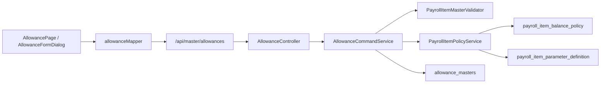

# 手当マスター管理 画面からDBまでの処理フロー V1

## 1. 全体フロー



## 2. CRUD

| 操作 | API | 処理 |
|---|---|---|
| 一覧 | `GET /api/master/allowances` | display order、id順。Policyは含めない |
| 詳細 | `GET /api/master/allowances/{id}` | 本体、詳細、Policy、parameter definitionsを返す |
| 登録 | `POST /api/master/allowances` | 本体とPolicyを同一トランザクションで保存 |
| 更新 | `PUT /api/master/allowances/{id}` | コード変更不可。本体とPolicyを同期 |
| 削除 | `DELETE /api/master/allowances/{id}` | `enabled=false`、`deleted_at`設定 |

参照権限は`master:view`、更新系は`master:manage`である。

## 3. 登録・更新時の検証

- コードは大文字へ正規化し、テナント内で一意。
- コードは作成後変更不可。
- `MANUAL`は手入力許可が必須。
- `FIXED`は既定額が必須。
- `AUTO`は有効な`ALLOWANCE`または`GENERAL` Ruleが必須。
- 金額・表示順は負数不可、最小額は最大額以下。
- PolicyのTRANSACTIONは従業員別適用でのみ使用可能。
- parameter key、型、既定値、SELECT選択肢、resolverを保存前に検証する。

## 4. 日報への接続

```text
allowance_masters
  -> AllowancePayrollItemValueProvider
  -> PayrollItemDailyInputService
  -> Policy / Enrollment / parameter解決
  -> PayrollItemCalculationService
  -> Ruleまたは固定・手入力計算
  -> daily_report_allowances
  -> 月次給与View・帳票
```

日報候補の基本条件は、`enabled=true`、`showOnDailyStatement=true`、単位が`DAILY/BOTH`である。さらにPolicyの適用対象、従業員Enrollment、入力元を判定する。

## 5. 主な関連クラス

| 層 | クラス・ファイル | 役割 |
|---|---|---|
| Page | `AllowancePage.vue` | 一覧・Dialog・CRUD |
| Form | `AllowanceFormDialog.vue` | 基本・計算・表示・Policy入力 |
| Fields | `useAllowanceFormFields.ts` | 手当本体のフォーム定義 |
| Policy UI | `PayrollItemPolicyEditor.vue` | 適用・入力元・残高・parameter定義 |
| Mapper | `allowanceMapper.ts` | APIと画面modelの変換 |
| Controller | `AllowanceController` | endpointと権限 |
| Query | `AllowanceQueryService` | 一覧・詳細・Policy取得 |
| Command | `AllowanceCommandService` | 検証、保存、論理削除 |
| Validator | `PayrollItemMasterValidator` | 共通給与項目検証 |
| Policy | `PayrollItemPolicyService` | Policy・parameter定義同期 |
| Provider | `AllowancePayrollItemValueProvider` | 計算用snapshotと日報候補 |
| Calculation | `PayrollItemCalculationService` | Rule、固定、手動変更、丸め |

## 6. DBテーブル

| テーブル | 内容 |
|---|---|
| `allowance_masters` | 手当の基本・計算・表示設定 |
| `payroll_item_balance_policy` | 適用対象・入力元・残高Policy |
| `payroll_item_parameter_definition` | 動的入力とRule parameter定義 |
| `employee_payroll_item_enrollment` | 従業員別適用期間 |
| `employee_payroll_item_setting` | 従業員別parameter値 |
| `employee_payroll_item_transaction` | 取引入力型の手当明細 |
| `daily_report_allowances` | 日報で確定した手当 |

## 7. 手当詳細provider

`AllowanceDetailResolver`と`AllowanceDetailProvider`の拡張口は存在するが、現在の`AllowanceDetailViewType`は`NONE`だけである。控除の税・保険詳細のような実providerは未実装で、詳細タブも表示しない。
