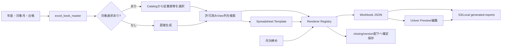

# 台帳管理 画面からStorage・月次締めまでの処理フロー V1

## 1. 全体像



## 2. 一覧と生成可否

`GET /api/operation/excel-books`は、システムメニューの台帳管理と同じ`excel_book_master`を直接参照する。別の台帳一覧を保持しているわけではない。

一覧取得時に次の依存関係を照合し、`generationReady`、`readinessIssues`、`monthlyClosingConfigured`を返す。

- Renderer Registryに描画方式が存在すること
- 行データ用Catalogと参照列が有効であること
- 対象選択用Catalog・値列・表示列が有効であること
- 汎用Rendererに必要な変数Mappingが存在すること
- Template方式ではStorageにWorkbook JSONが存在すること
- `monthly_closing_output_definition`に同じ`book_code`の有効な`LEDGER`定義があること

生成依存が不足した台帳も一覧から隠さず、生成ボタンを無効化して不足理由を表示する。月次締め定義がない場合は手動生成できるが、月次締めの自動生成対象にはならない。

## 3. 対象選択

| mode | 動作 |
|---|---|
| `NONE` | 対象月だけで1台帳を生成 |
| `SINGLE/MULTIPLE` | Catalogで許可された選択一覧を表示し、選択値ごとに1ファイル生成 |

選択値と表示列は`selection_source_name`、`selection_value_column`、`selection_display_columns`で定義する。送信値が取得済み候補に含まれることをサーバーで再検証する。

V1では選択型の`generation_unit`を`FILE_PER_SELECTION`に限定する。未実装の「複数対象をサーバー側で1ファイルへ集約」は管理画面から登録できない。

## 4. API

| method | path | 用途 |
|---|---|---|
| GET | `/api/operation/excel-books` | 有効台帳一覧・生成可否 |
| GET | `/api/operation/excel-books/settings` | 業務管理で設定した年度開始月 |
| GET | `/{bookCode}/selection-options` | 対象月の従業員等の候補 |
| POST | `/{bookCode}/generate` | 対象選択なし台帳生成 |
| POST | `/{bookCode}/generate-selected` | 選択対象ごとの台帳生成 |
| PUT | `/{bookCode}/generated/{targetMonth}` | 編集後Workbook保存 |
| PUT | `/{bookCode}/generated/{targetMonth}/selections/{selectionValue}` | 選択別Workbook保存 |

## 5. データ取得

`ExcelBookDataSourceRowQueryService`はデータソースCatalogに登録された物理View、列、where templateだけを使用する。

- tenant IDと対象月をNamed Parameterで渡す。
- Catalog外の列を拒否する。
- 識別子・where句・parameterを検証する。
- `maxRows`は1～10,000件で、上限超過を拒否する。

## 6. Renderer

`SpreadsheetLedgerRendererRegistry`が`renderer_key`から実装を解決する。現行には汎用繰返し行と、月間集計表・月間労務表・労務費支払一覧・入金確認表等の固定レイアウトRendererがある。

Rendererは次を決める。

- Template/変数Mappingが必要か
- 全Catalog列を使うか
- WorkbookのSheet・セル・Style・印刷設定
- 締め前編集と締め後編集の可否
- 安定パスを使って手入力値を引き継ぐか

## 7. 保存先

通常生成は概ね次の相対パスへ保存する。

```text
ledgers/{tenantId}/{bookCode}/{targetMonth}/...
```

選択別は`selections/{selectionValue}`、締め確定版は`closing/v{closingVersion}`を追加する。安定月次パス対応台帳は同月の作業版を上書きし、確定版生成時には作業版の手入力項目をRenderer規則で引き継ぐ。

## 8. 編集保存

次を満たす台帳だけ編集できる。

1. Rendererが締め前編集に対応する。
2. 安定月次パスを使用する。
3. 月次締め済みの場合、Rendererが締め後編集を明示的に許可する。

保存時に20MB上限を検証する。入金確認表等はEdit Handlerを通じて編集内容を顧客取引へ同期する。

## 9. 月次締め連携

月次締めの`MonthlyClosingJobService`は出力定義Typeが`LEDGER`のとき`generateForClosing(bookCode,targetMonth,version)`を呼ぶ。対象選択型は対象月の全候補を個別ファイル化し、確定Version metadataをWorkbookへ付加する。

`excel_book_master`への登録だけでは月次締め対象にならない。`monthly_closing_output_definition.output_type=LEDGER`かつ`output_code=book_code`の有効な定義が必要で、締めメニューの台帳一覧では「締め対象／手動生成のみ」として状態を確認できる。
