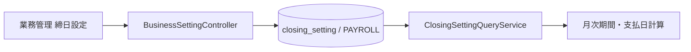
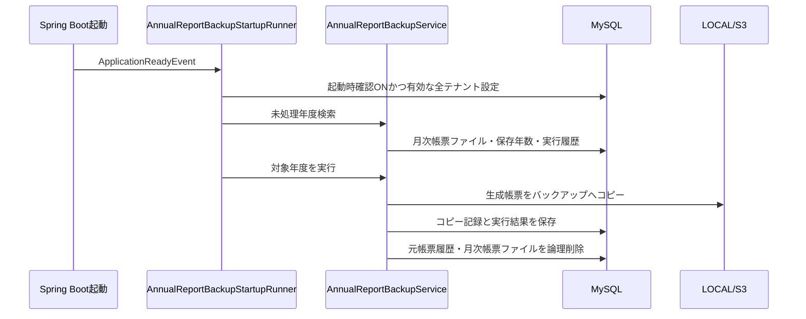

# 業務管理 画面からDB・後続処理までの処理フロー V1

ドメイン：業務管理

## 1. 目的と権限

`BusinessSettingsPage.vue`は次の5タブを持つ。

1. 退職時設定
2. 締日設定
3. 締め帳票
4. 帳票バックアップ
5. その他設定

画面ルートと管理APIは`SYS_ADMIN`専用である。一方、保存された退職設定、締日、外部リンク等は、それぞれの業務画面・共通機能から参照される。

## 2. 初期表示

```text
BusinessSettingsPage.vue
  -> useBusinessSettingsPage.load()
  -> 6個のGETをPromise.allで並行実行
     退職文言 / 退職TODO / 締日 / 締め帳票 / 帳票バックアップ / 外部リンク
  -> 成功した設定は個別に画面へ反映
  -> 1件でも失敗した場合は、失敗した設定名をまとめて表示
```

成功メッセージは4秒後に自動消去される。設定取得に失敗しても他のGETは中断せず、取得できた値は残る。

## 3. 退職時設定

### 3.1 文言

```text
PUT /api/admin/business-settings/resignation-message
  -> BusinessSettingService.saveResignationMessage()
  -> 前後空白を除去
  -> employee_resignation_setting（setting_code=DEFAULT）へ保存
```

未登録時はEntityの初期値を返す。初期値を表示しただけではDB行は作成されず、保存時に初めて永続化される。

### 3.2 退職時TODO

```text
POST/PUT/DELETE resignation-checklist
  -> TODOコードをtrim・大文字化
  -> tenant_id + codeの重複を拒否
  -> employee_resignation_checklist_master
```

- TODOコードは作成後変更不可。
- 削除は`deleted_at`を設定する論理削除。
- 有効かつ必須のTODOは、従業員退職APIの`EmployeeAdminService.validateRequiredChecklist()`でも検証される。
- したがって、画面のチェック制御を回避しても必須TODO未完了では退職できない。

## 4. 締日設定



初期SQLはテナントへ月末締め・翌月25日払いを配置する。未登録状態でも管理画面と業務側`ClosingSettingQueryService`の両方が、`ClosingSettingDefaults`に集約した同じ値を使用する。保存後はDBの`PAYROLL`設定を優先し、月次締め対象期間と給与支払日計算へ渡す。

保存時には日指定1～31、月オフセット-12～12を検証する。画面から有効・無効は切り替えず、保存された行は常に有効となる。

## 5. 締め帳票

```text
GET closing-outputs
  -> operation_report_previewのMONTHLY帳票一覧
  -> monthly_closing_output_definitionのREPORT定義とreportCodeで結合
  -> 生成有無・順序・保存年数を表示

PUT closing-outputs
  -> reportCodeの重複検証
  -> MONTHLY帳票の存在・有効状態を検証
  -> monthly_closing_output_definitionをupsert
```

このタブは帳票レイアウト、テンプレート、jobCodeを編集しない。それらの正本は「システム運用 → 帳票管理」である。

月次締めでは`MonthlyClosingOutputDefinitionService.findActiveCompanyOutputs()`が有効定義を順番に取得し、`MonthlyClosingJobService`が次を実行する。

- `REPORT`：帳票プレビュー定義のjobCodeを実行してファイル生成
- `LEDGER`：台帳生成基盤へ処理を委譲

ただし現画面が編集するのは`REPORT`だけである。また顧客締め対象の`MONTHLY_INVOICE`と`MONTHLY_ORDER_FORM`は自社月次締めの実行計画から除外される。

## 6. 年度帳票バックアップ

### 6.1 設定

`annual_report_backup_setting`へ会計年度開始月、年度終了後の猶予日数、起動時確認の有無、設定の有効状態を保存する。未登録時は4月開始・14日猶予・起動時確認ON・有効を返す。

### 6.2 自動実行



24時間稼働は不要である。年度末＋猶予日数を過ぎた後の最初のアプリ起動で未処理年度を検出する。

バックアップ対象は、`monthly_closing_output_definition.backup_retention_years`が1年以上の月次帳票ファイルだけである。コピー先は次の形式となる。

```text
documents/backups/reports/{tenantId}/{fiscalYear}/{reportCode}/{targetMonth}/v{closingVersion}/{fileId}-{fileName}
```

コピー完了後、元の`report_history`と`monthly_closing_report_file`は論理削除される。バックアップファイル自体は`annual_report_backup_file`から追跡できる。処理済み年度を再実行しても、完了済みの実行結果を返し重複コピーしない。

AWS S3側にも`documents/backups/reports/`を2557日後に期限切れにするLifecycleがある。DBの保存期限とS3 Lifecycleの両方を揃えて管理する必要がある。

## 7. その他設定

管理画面でJiraインシデント報告URLとConfluenceマニュアルURLを保存する。

```text
PUT /api/admin/business-settings/external-support-links
  -> HTTPSかつhostあり、2048文字以内を検証
  -> external_support_link_setting（DEFAULT）

GET /api/support-links
  -> AppHeader.vue
  -> ユーザーメニューから別タブで開く
```

管理APIは`SYS_ADMIN`専用だが、参照APIはログイン利用者向け共通ヘッダーで使われる。Fuyo固有URLは`sql/admin/external_support_links_v1.sql`で初期配置し、Java Coreへは保持しない。DB未登録時は空URLを返し、リンクを表示しない。

## 8. 主なDBテーブル

| テーブル | 役割 |
|---|---|
| `employee_resignation_setting` | 退職Dialog文言 |
| `employee_resignation_checklist_master` | 退職TODOマスター |
| `closing_setting` | 給与締日・支払日ルール |
| `operation_report_preview` | 月次帳票の表示・jobCode・出力形式の正本 |
| `monthly_closing_output_definition` | 締め生成対象、順序、必須、保存年数 |
| `annual_report_backup_setting` | 年度バックアップ設定 |
| `annual_report_backup_execution` | 年度単位の実行状態・件数・エラー |
| `annual_report_backup_file` | コピー元・先・保持期限の対応 |
| `monthly_closing_report_file` | 月次締め時に生成した帳票ファイル |
| `report_history` | 通常帳票履歴。年度バックアップ成功時に対象分を論理削除 |
| `external_support_link_setting` | Jira・Confluenceリンク |

## 9. 主な関連クラス

| 層 | クラス・モジュール | 役割 |
|---|---|---|
| Frontend | `BusinessSettingsPage.vue` | 5タブの表示・Form |
| Frontend | `useBusinessSettingsPage.ts` | 並行読込、保存、通知、手動バックアップ |
| Backend | `BusinessSettingController` | SYS_ADMIN管理API |
| Backend | `BusinessSettingService` | 退職、締日、締め帳票設定 |
| Backend | `AnnualReportBackupSettingService` | バックアップ設定と手動実行 |
| Backend | `AnnualReportBackupStartupRunner` | 起動時の未処理年度追跡 |
| Backend | `AnnualReportBackupService` | コピー、照合、履歴整理、実行記録 |
| Backend | `ExternalSupportLinkSettingService` | URL検証・保存・既定値 |
| Downstream | `EmployeeAdminService` | 必須退職TODOのサーバー検証 |
| Downstream | `ClosingSettingQueryService` | 給与締日・支払日の共通参照 |
| Downstream | `MonthlyClosingJobService` | 設定された帳票・台帳の月次生成 |
