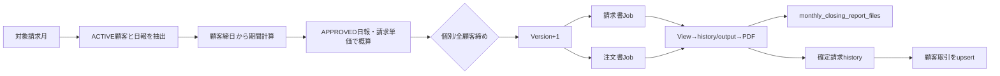

# 顧客請求締め 画面から請求履歴・取引までの処理フロー V1

## 1. 全体像

## 2. 対象顧客

`CustomerBillingTargetService`は次をすべて満たす顧客を対象とする。

1. 顧客が未削除で契約状態`ACTIVE`。
2. 対象月近辺に日報が存在する候補顧客。
3. 顧客固有締日から解決した正確な開始日～終了日に請求対象データがある。

未契約・契約終了顧客は対象一覧と締め対象へ含めない。

## 3. 請求期間

`CustomerBillingPeriodService`が顧客の締日Type、日、月Offsetを使い、前回締日の翌日から当回締日までを計算する。暦月末固定ではない。

画面の`targetMonth`は請求期間を決める業務月であり、実際の日報検索範囲は顧客ごとに異なる。

## 4. 概算一覧

`GET /api/operation/customer-billing/summary`は、対象顧客ごとに期間、税抜、消費税、税込、計算可否、締日到来、締めVersionを返す。

概算はApproved日報の請求Snapshotを使う。

- `DAILY`：`work_hours / 8 × base_unit_price`
- `HOURLY`：`work_hours × base_unit_price`
- `MONTHLY`：同一`billing_rate_id`の先頭1件だけ基準単価
- 残業・深夜・休日・通勤：各数量×単価

## 5. 締めAPI

| method | path | 動作 |
|---|---|---|
| POST | `/close?targetMonth&customerId` | 顧客1社を初回締め |
| POST | `/reclose?targetMonth&customerId` | 初回締め完了済みの顧客1社をVersion+1で再締め |
| POST | `/close-all?targetMonth` | 締日到来済みかつ未締めの顧客だけ締め |

個別締めは締日前でも確認後に例外実行できる。全顧客締めは実行日が期間終了日前の顧客と、既に締め済みの顧客を除外する。顧客ごとに`REQUIRES_NEW` Transactionで実行するため、1社の失敗で他社を巻き戻さない。

画面の「本日締め可能」は、締日到来済みかつ未締めの顧客数である。締め済み顧客は含めない。

## 6. 帳票生成

`CustomerBillingClosingJobService`は次を生成する。

- 請求書：顧客の`invoiceType`から実際の請求書パターンを解決
- 注文書：`MONTHLY_ORDER_FORM`

共通`MonthlyClosingJobExecutor`へ顧客ID・顧客名・期間・Version・scope=`CUSTOMER_BILLING`を渡す。帳票基盤ではViewからhistory/output tableへ確定し、Jasper等でファイルを生成して`monthly_closing_report_files`へ記録する。

## 7. 顧客取引への同期

帳票生成後、`MonthlyClosingCustomerTransactionService`が確定請求historyを読み、顧客管理の取引をupsertする。

- 請求金額：確定請求税込額
- 入金予定日：顧客支払日Ruleから計算
- 根拠：invoice history IDとclosing version

再締めでは同一対象月・顧客の取引を新Versionの確定請求へ更新する。

## 8. 帳票画面

顧客一覧と帳票一覧は別タブである。帳票タブでは最初に対象顧客を選択し、請求書・注文書だけを表示する。

- 請求書の簡易Preview：`customerId + periodFrom + periodTo`で最新日報を検索する。暦月一律ではない。
- 注文書の簡易Preview：`targetMonth + customerId`で確定履歴を検索する。
- 本印刷：`targetMonth + reportCode + targetId`で選択顧客の最新確定ファイルだけを取得する。

顧客未選択時に全顧客を混在表示しない。顧客ごとに異なる締めVersionは、それぞれの最新確定版を使用する。

## 9. 監査

締め完了時に`customer_billing_closings.closed_by`へ認証ユーザー名を保存する。認証主体が存在しないシステム実行時は`SYSTEM`を保存する。
