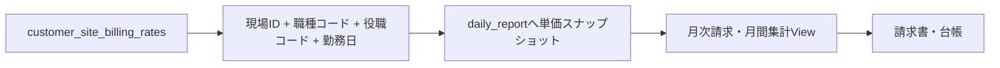

# 顧客管理 入力項目の利用先・システム連携 V1

ドメイン：顧客管理

## 1. 目的

「顧客情報」「取引管理」で入力・選択した値が、API、DBを経由してどの機能で利用されるかを整理する。

本資料では、単にDBへ保存されるだけの項目と、日報・請求・帳票・メール等へ実際に連携される項目を区別する。

## 2. 判定区分

| 区分 | 意味 |
|---|---|
| 利用中 | 別画面、計算、帳票等から実際に参照される |
| 画面内利用 | 顧客管理画面の表示・検索・検証では使うが、他機能への連携は確認できない |
| 保存のみ | DBへ保存されるが、現行コードで業務利用先を確認できない |
| 派生値 | 利用者が直接入力せず、システムが計算・付与する |
| 未連携 | 連携を想定した項目だが、連携処理がまだ存在しない |

## 3. 共通データ経路

```text
画面入力
  -> frontend customer model
  -> frontend mapper
  -> API Request DTO
  -> Controller
  -> Command Serviceの検証
  -> backend mapper
  -> Entity
  -> MySQL / RDS
  -> 他機能のService・View・帳票SQLが参照
```

文字列の任意項目は、フロントまたはバックエンドのMapperで空文字を`NULL`へ正規化する。顧客、現場、顧客社員、請求単価、取引は`tenant_id`によりテナントを分離する。

---

## 4. 顧客基本情報

保存API：`POST /api/customers`、`PUT /api/customers/{id}`

保存先：`customers`

| 画面項目 | API項目 | DBカラム | 区分 | 現在の利用先・連携内容 |
|---|---|---|---|---|
| 顧客名 | `name` | `name` | 利用中 | 顧客一覧・選択肢、日報・翌日準備へ顧客名をスナップショット、月次請求書・注文書・封筒・台帳等の顧客名 |
| ふりがな | `furiganaName` | `furigana_name` | 画面内利用 | 顧客一覧の表示・検索、編集。現行バックエンドでは他業務への参照を確認できない |
| 短縮社名 | `shortName` | `short_name` | 画面内利用 | 顧客一覧の表示・検索、編集。帳票・計算での参照は確認できない |
| 郵便番号 | `postNo` | `post_no` | 利用中 | 封筒宛名、月次注文書の顧客住所情報 |
| 住所 | `address` | `address` | 利用中 | 顧客一覧、封筒宛名、月次注文書の顧客住所情報 |
| 代表者名 | `representativeName` | `representative_name` | 画面内利用 | 顧客一覧・編集では利用。現行帳票SQL等からの参照は確認できない |
| 電話番号 | `phone` | `phone` | 画面内利用 | 顧客一覧・編集では利用。現行の帳票・メール等への連携は確認できない |
| 職種 | `jobType` | `job_type` | 保存のみ | 顧客一覧には表示するが、請求単価の職種コードや日報の職種とは連動していない |
| 契約状態 | `contractFlag` | `contract_flag` | 保存・表示 | `ACTIVE`（契約中）/ `INACTIVE`（未契約）/ `ENDED`（契約終了）の選択式。処理可否の判定には使わない |
| 請求書パターン | `invoiceType` | `invoice_type` | 利用中 | `PATTERN_1`〜`3`を請求書帳票コードへ解決し、顧客ごとの請求書レイアウトを選択 |
| 締日 | `closingDayRule` | 下記3カラム | 利用中 | 顧客の請求対象期間、締日通知、取引への締日スナップショットを生成 |
| 支払日 | `paymentDayRule` | 下記3カラム | 利用中 | 取引の入金予定日を計算し、取引・入金確認表へ支払条件をスナップショット |

### 4.1 締日・支払日のDB展開

`DayRule`は1つのJSON objectとしてAPI送信され、DBでは3カラムへ分解される。

| API | 締日DB | 支払日DB | 内容 |
|---|---|---|---|
| `type` | `closing_day_type` | `payment_day_type` | 月末・日付指定等の規則 |
| `value` | `closing_day_value` | `payment_day_value` | 日付指定の場合の1〜31 |
| `monthOffset` | `closing_month_offset` | `payment_month_offset` | 当月、翌月等の月差 |

### 4.2 顧客名のスナップショット

日報・翌日準備では、顧客IDだけでなく、その時点の顧客名も保存する。

```text
customers.id / name
  -> 顧客・現場候補API
  -> 日報または翌日準備で顧客を選択
  -> customer_id + customer_nameを業務データへ保存
```

このため、後で顧客名を変更しても、既に保存された日報・翌日準備の表示名は自動では書き換わらない。

---

## 5. 現場情報

顧客保存requestの`sites[]`として送信する。

保存先：`customer_sites`

| 画面項目 | API項目 | DBカラム | 区分 | 現在の利用先・連携内容 |
|---|---|---|---|---|
| 現場ID | `id` | `id` | 派生値 | DB採番。日報、翌日準備、請求単価の参照キー |
| 現場名 | `name` | `name` | 利用中 | 日報・翌日準備の選択肢、業務データへの現場名スナップショット、作業伝票・台帳・請求明細 |
| 担当者名 | `contactPersonName` | `contact_person_name` | 保存のみ | 顧客編集画面での管理のみ。メールや帳票への連携は確認できない |
| 担当者電話番号 | `contactPersonPhone` | `contact_person_phone` | 保存のみ | 顧客編集画面での管理のみ |
| 担当者メール | `contactPersonEmail` | `contact_person_email` | 保存のみ | 形式検証と保存のみ。メール基盤への自動登録・送信先解決は未実装 |
| 会社からの距離 | `distanceFromCompanyKm` | `distance_from_company_km` | 利用中 | 翌日準備の配車情報へコピーし、作業伝票の距離表示に使用 |

### 5.1 現場名と距離の連携

```text
customer_sites
  -> GET /api/customers/options
  -> useCustomerMasterStore
  -> 日報・翌日準備の現場候補
  -> customer_site_id / site_nameを業務データへ保存
  -> distance_from_company_kmを翌日準備へコピー
  -> 作業伝票プレビュー・PDFで使用
```

現場名・距離は業務データへスナップショットされるため、マスター変更後も既存データは原則として保存時点の値を維持する。

---

## 6. 顧客社員

顧客保存requestの`employees[]`として送信する。

保存先：`customer_employees`

| 画面項目 | API項目 | DBカラム | 区分 | 現在の利用先・連携内容 |
|---|---|---|---|---|
| 顧客社員ID | `id` | `id` | 派生値 | DB自動採番。内部の行識別とメール同期キーに使用し、画面には表示しない |
| 名前 | `name` | `name` | 画面内利用 | 顧客社員一覧の表示・編集 |
| ふりがな | `furiganaName` | `furigana_name` | 画面内利用 | 顧客社員一覧の表示・検索 |
| 役職 | `position` | `position` | 画面内利用 | 顧客社員一覧の表示・編集 |
| 電話番号 | `phone` | `phone` | 画面内利用 | 顧客社員一覧の表示・編集 |
| メールアドレス | `email` | `email` | 未連携 | To/CC選択時の必須検証はあるが、現在のメール宛先グループへ自動同期しない |
| 請求書送付先 | `invoiceToFlag` | `invoice_to_flag` | 利用中 | 顧客別メールグループへTOとして同期。有効時はメール必須 |
| 請求書CC | `invoiceCcFlag` | `invoice_cc_flag` | 利用中 | 顧客別メールグループへCCとして同期。有効時はメール必須 |

現状のメール基盤は`mail_recipient_group`と`mail_recipient`を参照する。`customer_employees`からこれらへ登録・同期するService、Trigger、Lambdaは存在しない。

したがって、画面上で請求書To/CCを設定しても、それだけでは請求書メールの宛先にならない。V1で自動連携する場合は別実装が必要である。

---

## 7. 請求単価

保存API：`POST /api/customers/{customerId}/billing-rates/bulk-save`

保存先：`customer_site_billing_rates`

| 画面項目 | API項目 | DBカラム | 区分 | 現在の利用先・連携内容 |
|---|---|---|---|---|
| 順番 | `displayOrder` | `display_order` | 画面内利用 | 顧客の請求単価一覧の表示順 |
| 現場 | `customerSiteId` | `customer_site_id` | 利用中 | 日報の現場と単価を結ぶキー |
| 職種コード | `jobCode` | `job_code` | 利用中 | 日報保存時の適用単価検索キー。日報・請求明細へスナップショット |
| 職種名 | `jobName` | `job_name` | 利用中 | 適用単価決定後に日報へスナップショットし、月間集計・請求明細へ表示 |
| 役職コード | `siteRoleCode` | `site_role_code` | 利用中 | 日報保存時の適用単価検索キー。未指定の内部標準値は`GENERAL` |
| 現場役職 | `siteRoleName` | `site_role_name` | 利用中 | 日報・月間集計・請求明細の表示値 |
| 単価区分 | `billingUnit` | `billing_unit` | 利用中 | `DAILY`は勤務時間÷8、`HOURLY`は勤務時間、`MONTHLY`は顧客締め期間内で同じ単価を1回だけ計上 |
| 基準単価 | `baseUnitPrice` | `base_unit_price` | 利用中 | 日報へ保存し、基本請求額を計算 |
| 残業単価 | `overtimeUnitPrice` | `overtime_unit_price` | 利用中 | 残業時間×残業単価 |
| 深夜単価 | `nightUnitPrice` | `night_unit_price` | 利用中 | 深夜時間×深夜単価 |
| 休日単価 | `holidayUnitPrice` | `holiday_unit_price` | 利用中 | 休日労働時間×休日単価 |
| 通勤単価 | `commuteUnitPrice` | `commute_unit_price` | 利用中 | 日報走行距離×通勤単価 |
| 適用開始日 | `effectiveFrom` | `effective_from` | 利用中 | 勤務日に適用できる単価の期間判定、期間重複防止 |
| 適用終了日 | `effectiveTo` | `effective_to` | 利用中 | 勤務日に適用できる単価の期間判定。`NULL`は終了日なし |
| 有効 | `activeFlag` | `active_flag` | 利用中 | `true`の単価だけを日報保存時の候補にする |
| 備考 | `note` | `note` | 保存のみ | 管理用メモ。請求計算・帳票では使用しない |

### 7.1 日報・請求への連携



日報保存時に`CustomerSiteBillingRateQueryService.findApplicableRate()`が単価を解決し、次の値を`daily_report`へコピーする。

- 請求単価ID
- 職種コード・名称
- 役職コード・名称
- 単価区分
- 基準・残業・深夜・休日・通勤単価

単価マスターを後から変更しても、既存日報の請求単価は自動変更されない。再計算には日報の再保存等、単価スナップショットを更新する処理が必要になる。

### 7.2 単価区分の現行制約

画面では`DAILY`、`HOURLY`、`MONTHLY`を選択できる。`FIXED`はV1で廃止し、
既存値はSQL資産適用時に`MONTHLY`へ移行する。

顧客締めでは`monthly_invoice_input`の`period_from`～`period_to`を基準に、
`vw_monthly_invoice_execution_detail`が`MONTHLY`の基本料金を同一請求単価IDごとに1回だけ計上する。
確定処理は従来どおりViewから履歴テーブルへ保存するため、再締め時も最新日報から新Versionを生成する。

---

## 8. 取引管理

取引管理画面では、取引の元データを新規入力しない。利用者が直接入力できるのは入金確認Dialogの項目だけである。

更新API：`PUT /api/customers/{customerId}/transactions/{transactionId}/confirm-payment`

保存先：`customer_transactions`

### 8.1 画面から入力する項目

| 画面項目 | API項目 | DBカラム | 区分 | 現在の利用先・連携内容 |
|---|---|---|---|---|
| 入金確認日 | `confirmedPaymentDate` | `confirmed_payment_date` | 利用中 | 取引一覧、入金確認表に表示 |
| 入金額 | `paidAmount` | `paid_amount` | 利用中 | 回収額・残額・入金状態の計算、入金確認表との双方向更新 |
| 手数料 | `fee` | `fee` | 利用中 | 顧客負担の決済済み額として回収額に加算、入金確認表との双方向更新 |
| 相殺額 | `offsetAmount` | `offset_amount` | 利用中 | 別債権・債務との相殺として回収額に加算、入金確認表との双方向更新 |
| その他調整額 | `adjustmentAmount` | `adjustment_amount` | 利用中 | 正負の差額調整として回収額に加算。0以外の場合は備考必須 |
| 備考・調整理由 | `note` | `note` | 利用中 | 調整理由の必須検証、取引一覧・入金確認表に表示 |

### 8.2 画面に表示するが直接入力しない項目

| 表示項目 | DBカラム | 区分 | 内容 |
|---|---|---|---|
| 顧客ID・顧客名 | `customer_id`・`customers.name` | 参照値 | 顧客絞込・一覧表示 |
| 対象月 | `target_month` | 参照値 | 顧客・対象月単位の取引識別 |
| 締日 | `closing_day_*` | スナップショット | 取引生成時点の顧客締日 |
| 支払日 | `payment_day_*` | スナップショット | 取引生成時点の顧客支払条件 |
| 取引金額 | `billing_amount` | 参照値 | 入金状態判定の基準となる請求額 |
| 入金予定日 | `expected_payment_date` | 参照値 | 顧客の支払日規則から計算された予定日 |
| 入金合計 | `total_amount` | 派生値 | サーバーが4金額の合計を再計算して保存 |
| 残額 | DBカラムなし | 派生値 | 画面・入金確認Viewで`請求額 - 回収額`を計算 |
| 入金状態 | `payment_status` | 派生値 | サーバーが回収額と請求額から再判定 |

### 8.3 入金値の連携

```text
取引管理の入金確認Dialog
  -> CustomerTransactionCommandService
  -> customer_transactions
  -> vw_receipt_confirmation_ledger
  -> 入金確認表Spreadsheet
```

入金確認表Spreadsheetから金額を編集した場合も、`ReceiptConfirmationSpreadsheetEditHandler`から同じ`CustomerTransactionCommandService.confirmPaymentFromLedger()`を呼ぶ。したがって、取引管理画面と台帳は同じDBレコードと同じ入金状態判定を共有する。

### 8.4 回収額・入金状態

```text
回収額 = 入金額 + 手数料 + 相殺額 + その他調整額
残額   = 請求額 - 回収額
```

| 条件 | `payment_status` |
|---|---|
| 回収額が0以下 | `UNPAID` |
| 回収額が請求額未満 | `PARTIAL` |
| 回収額が請求額と一致 | `PAID` |
| 回収額が請求額を超過 | `OVERPAID` |

`payment_status`は顧客一覧の「最新入金」にも利用され、最新取引が`PAID`または`OVERPAID`なら「済」、それ以外は「未」と表示される。

---

## 9. 入力項目から見た主要な未連携・注意点

### 9.1 顧客社員のメール設定

顧客保存時に`CustomerInvoiceMailGroupSyncService`が顧客別メールグループを生成・更新する。

- groupKey：`CUSTOMER_INVOICE_{customerId}`
- groupName：`請求書送付先：{顧客名}`
- recipientKey：`CUSTOMER_EMPLOYEE_{customerEmployeeId}`
- `invoiceToFlag = true`：有効なTO
- `invoiceCcFlag = true`：有効なCC
- メールあり・両Flagなし：宛先一覧へは同期するが無効

同じ担当者をTOとCCへ同時指定することはできない。顧客担当者の再同期時も、
メール管理画面から手動で追加した宛先は削除しない。

### 9.2 現場連絡先

現場担当者の氏名・電話・メールは保存されるが、現時点では他機能から参照されていない。

### 9.3 顧客の職種・契約状態

`jobType`は自由入力の管理項目である。`contractFlag`は3状態の管理コードへ統一したが、
請求単価、日報、顧客締め、請求可否とはまだ連動しない。

既存の自由入力値は`customer_contract_status_v1.sql`で移行する。既知の「契約中」等は
`ACTIVE`へ、空値と判定不能な値は安全側の`INACTIVE`へ変換する。

### 9.4 月額・固定額の請求単価

画面登録は可能だが、月次請求計算は未対応である。V1で使用すると月次請求を停止させるため、実運用では`DAILY`または`HOURLY`を使用するか、計算規則を追加する必要がある。

### 9.5 マスター変更と過去データ

顧客名、現場名、請求単価は業務データへスナップショットされる箇所がある。マスターを変更しても、過去の日報・翌日準備・確定履歴が自動更新されるとは限らない。

## 10. 調査した主な実装

### フロントエンド

```text
frontend/src/features/customer/composables/useCustomerFormFields.ts
frontend/src/features/customer/composables/useCustomerSiteColumns.ts
frontend/src/features/customer/composables/useCustomerEmployeeColumns.ts
frontend/src/features/customer/composables/useCustomerSiteBillingRateColumns.ts
frontend/src/features/customer/components/CustomerFormDialog.vue
frontend/src/features/customer/components/CustomerBillingRateTab.vue
frontend/src/features/customer/components/PaymentConfirmDialog.vue
frontend/src/features/customer/mapper/customerMapper.ts
frontend/src/features/customer/mapper/customerSiteBillingRateMapper.ts
frontend/src/features/customer/mapper/customerTransactionMapper.ts
```

### バックエンド

```text
backend/src/main/java/com/project/backend/features/customer/service/CustomerCommandService.java
backend/src/main/java/com/project/backend/features/customer/service/CustomerQueryService.java
backend/src/main/java/com/project/backend/features/customer/service/CustomerSiteBillingRateQueryService.java
backend/src/main/java/com/project/backend/features/customer/service/CustomerSiteBillingRateCommandService.java
backend/src/main/java/com/project/backend/features/customer/service/CustomerTransactionCommandService.java
backend/src/main/java/com/project/backend/features/dailyreport/service/DailyReportBillingRateService.java
backend/src/main/java/com/project/backend/features/operation/preparation/service/DailyPreparationService.java
backend/src/main/java/com/project/backend/features/operation/book/service/ReceiptConfirmationSpreadsheetEditHandler.java
backend/src/main/resources/sql/system/report/invoice/monthly_invoice_foundation_v1.sql
backend/src/main/resources/sql/system/excelbook/receipt_confirmation_v1.sql
backend/src/main/resources/sql/system/notice/closing_notice_foundation_v1.sql
```
