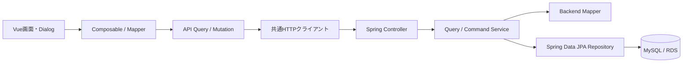
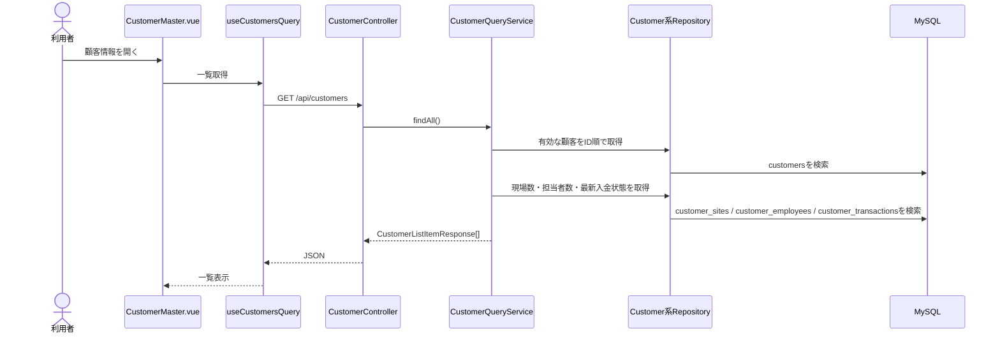
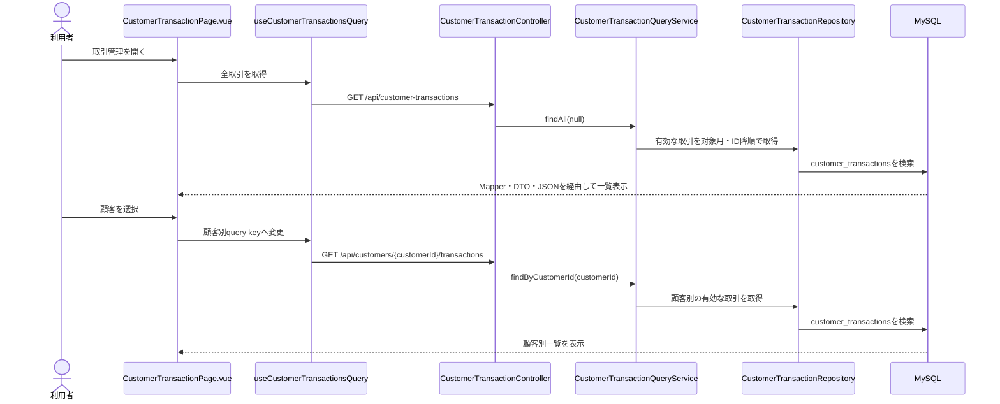

# 顧客管理（顧客情報・取引管理）画面からDBまでの処理フロー V1

ドメイン：顧客管理

## 1. 目的

顧客管理メニューのうち、次の2画面について、画面操作からDB読込・更新までの現行実装を整理する。

- 顧客情報：`/customer/information`
- 取引管理：`/customer/transaction`

本資料はコードリーディングとV1安定化の入口として使用する。クラス一覧は、現在の画面フローから直接呼ばれるものを中心に記載する。

## 2. 対象外

次の処理は本資料に含めない。

- 顧客締め、全顧客締め、再締め
- 自社の月次締め
- 請求書、注文書等の帳票生成
- 封筒宛名印刷
- 日報側での請求単価解決

取引管理画面は既に存在する取引を照会・入金確定する画面として扱い、取引レコードが締め処理から生成されるフローは説明しない。

## 3. 全体構成



共通事項：

- フロントエンドはTanStack Queryで取得結果をキャッシュする。
- API成功後は対象query keyを無効化し、必要なデータを再取得する。
- バックエンドはControllerでリクエストを受け、Query ServiceまたはCommand Serviceへ委譲する。
- Entityは`BaseEntity`を継承し、`tenant_id`、`created_at`、`updated_at`、`deleted_at`を持つ。
- 顧客系の通常検索は`deleted_at IS NULL`を条件にする。

---

## 4. 顧客情報

### 4.1 画面構成

`CustomerMaster.vue`が一覧画面、`CustomerFormDialog.vue`が登録・編集Dialogを担当する。

顧客編集Dialogのタブ：

1. 基本情報
2. 現場一覧
3. 顧客社員
4. 請求単価

基本情報・現場・顧客社員は「顧客情報を保存」で一括送信する。請求単価は請求単価タブ内の保存操作で別に送信する。

### 4.2 顧客一覧の取得



一覧には顧客基本情報に加えて、現場数、顧客社員数、最新取引の入金状態が表示用データとして返る。

### 4.3 顧客詳細の取得

1. 一覧行をクリックする。
2. `useCustomerEditDialog.openEdit()`が顧客IDを選択し、Dialogを開く。
3. `useCustomerDetailQuery`が`GET /api/customers/{id}`を実行する。
4. `CustomerQueryService.findDetail()`が顧客、現場、顧客社員、最新入金状態を取得する。
5. `CustomerMapper.toDetail()`が`CustomerDetailResponse`へ変換する。
6. フロントの`customerMapper.ts`が画面用の顧客・現場・顧客社員へ変換する。
7. `CustomerFormDialog.vue`が各タブへ表示する。

請求単価は顧客詳細レスポンスには含まれず、請求単価タブを表示できる既存顧客に対して別APIから取得する。

### 4.4 顧客の新規登録

```text
新規登録ボタン
  -> useCustomerEditDialog.openCreate()
  -> CustomerFormDialogで入力
  -> customerSchemaと子明細の画面検証
  -> customerMapper.toCustomerSaveRequest()
  -> useCreateCustomerMutation
  -> POST /api/customers
  -> CustomerController.create()
  -> CustomerCommandService.create()
  -> サーバー検証
  -> CustomerMapperでEntityへ変換
  -> customersをINSERT
  -> customer_sitesをINSERT
  -> customer_employeesをINSERT
  -> 顧客一覧・顧客/現場候補を再取得
```

顧客、現場、顧客社員の保存は`CustomerCommandService`の1トランザクション内で行われる。途中で失敗した場合は一括でロールバックされる。

新規顧客はDB採番前の現場IDが存在しないため、請求単価を同時登録できない。一度顧客と現場を保存した後、編集画面の請求単価タブから登録する。

### 4.5 顧客の更新

```text
顧客編集Dialogで保存
  -> CustomerFormDialog.handleSave()
  -> customerSchemaと子明細の画面検証
  -> customerMapper.toCustomerSaveRequest()
  -> useUpdateCustomerMutation
  -> PUT /api/customers/{id}
  -> CustomerController.update()
  -> CustomerCommandService.update()
  -> 顧客の存在確認・サーバー検証
  -> customersを更新
  -> 現場の追加・更新・論理削除を同期
  -> 顧客社員の追加・更新・論理削除を同期
  -> 顧客一覧・詳細・顧客/現場候補を再取得
```

現場と顧客社員は画面上で`_isNew`、`_isUpdated`、`_isDeleted`を管理し、API requestへ変換する。サーバーは主にID、`_isNew`、`_isDeleted`から追加・更新・削除を判定する。更新・削除時は、指定IDが対象顧客に所属していることを検証する。

### 4.6 顧客の削除

```text
顧客削除
  -> DELETE /api/customers/{id}
  -> CustomerCommandService.delete()
  -> CustomerReferenceGuardで参照有無を検証
  -> 現場請求単価を論理削除
  -> 現場を論理削除
  -> 顧客社員を論理削除
  -> 顧客を論理削除
```

日報、翌日準備、取引情報、請求履歴から参照されている顧客は削除できない。現場単体の削除も日報または翌日準備から参照されている場合は拒否される。

### 4.7 請求単価の取得・保存

#### 取得

```text
請求単価タブ
  -> useCustomerSiteBillingRatesQuery
  -> GET /api/customers/{customerId}/billing-rates
  -> CustomerSiteBillingRateController.findAll()
  -> CustomerSiteBillingRateQueryService.findByCustomerId()
  -> CustomerSiteBillingRateRepository
  -> customer_site_billing_ratesを検索
```

#### 一括保存

```text
請求単価タブで保存
  -> CustomerBillingRateTab.saveBillingRates()
  -> 追加・更新・削除行を分類
  -> useBulkSaveCustomerSiteBillingRatesMutation
  -> POST /api/customers/{customerId}/billing-rates/bulk-save
  -> CustomerSiteBillingRateCommandService.bulkSave()
  -> 顧客/現場の所有関係・入力値・適用期間重複を検証
  -> 削除、追加、更新を1トランザクションで実行
  -> 請求単価を再取得
```

画面の一括保存は全行を1トランザクションで処理する。1行でも失敗した場合、その保存操作全体がロールバックされる。

現行実装では、請求単価タブから指定した削除は`repository.delete()`による物理削除である。一方、顧客または現場の削除に伴う請求単価削除は`deleted_at`を設定する論理削除である。

### 4.8 顧客情報で使用するAPI

| HTTP | API | 画面での用途 |
|---|---|---|
| GET | `/api/customers` | 顧客一覧 |
| GET | `/api/customers/{id}` | 顧客詳細、現場、顧客社員 |
| POST | `/api/customers` | 顧客新規登録 |
| PUT | `/api/customers/{id}` | 顧客・現場・顧客社員の更新 |
| DELETE | `/api/customers/{id}` | 顧客の論理削除 |
| GET | `/api/customers/options` | 他画面が使用する顧客・現場候補の再同期 |
| GET | `/api/customers/{customerId}/billing-rates` | 請求単価一覧 |
| POST | `/api/customers/{customerId}/billing-rates/bulk-save` | 請求単価の一括保存 |

### 4.9 顧客情報のDBテーブル

| テーブル | 内容 | 主な関連 |
|---|---|---|
| `customers` | 顧客基本情報、請求書パターン、締日・支払日 | 親テーブル |
| `customer_sites` | 顧客の現場、連絡先、会社からの距離 | `customer_id`で顧客に所属 |
| `customer_employees` | 顧客社員、連絡先、請求書To/CC設定 | `customer_id`で顧客に所属 |
| `customer_site_billing_rates` | 現場・職種・役職・適用期間別の請求単価 | `customer_site_id`で現場に所属 |
| `customer_transactions` | 一覧用の最新入金状態の参照先 | 顧客情報画面からは更新しない |

### 4.10 顧客情報の関連クラス・モジュール

#### フロントエンド

| クラス・モジュール | 役割 |
|---|---|
| `CustomerMaster.vue` | 顧客一覧画面とDialogの配置 |
| `useCustomerMasterPage.ts` | 一覧、列、Toolbar、編集Dialogを組み立てる |
| `CustomerFormDialog.vue` | 基本情報・現場・顧客社員・請求単価の編集Dialog |
| `useCustomerEditDialog.ts` | 新規・編集・保存・削除の画面状態とAPI呼出を管理 |
| `useCustomerFormFields.ts` | 顧客基本情報フォームの項目定義 |
| `useCustomerSiteColumns.ts` | 現場一覧の列・編集定義 |
| `useCustomerEmployeeColumns.ts` | 顧客社員一覧の列・編集定義 |
| `useEditableChildRows.ts` | 現場・顧客社員の追加、更新、削除状態を管理 |
| `customerSchema.ts` | 顧客基本情報のフロント入力検証 |
| `customerMapper.ts` | API DTOと画面modelの相互変換 |
| `useCustomersQuery.ts` | 顧客一覧GET |
| `useCustomerDetailQuery.ts` | 顧客詳細GET |
| `useCreateCustomerMutation.ts` | 顧客POSTとキャッシュ再同期 |
| `useUpdateCustomerMutation.ts` | 顧客PUTとキャッシュ再同期 |
| `useDeleteCustomerMutation.ts` | 顧客DELETEとキャッシュ再同期 |
| `CustomerBillingRateTab.vue` | 請求単価の編集・検証・一括保存 |
| `useCustomerSiteBillingRatesQuery.ts` | 請求単価一覧GET |
| `useBulkSaveCustomerSiteBillingRatesMutation.ts` | 請求単価の一括保存POST |
| `customerSiteBillingRateMapper.ts` | 請求単価API DTOと画面modelの変換 |
| `useCustomerMasterStore.ts` | 他画面が使う顧客・現場候補のPiniaキャッシュ |

#### バックエンド

| クラス | 役割 |
|---|---|
| `CustomerController` | 顧客一覧・詳細・登録・更新・削除API |
| `CustomerQueryService` | 顧客一覧・詳細・候補の読込処理 |
| `CustomerCommandService` | 顧客・現場・顧客社員の検証と一括保存 |
| `CustomerReferenceGuard` | 顧客・現場の削除前に参照有無を検証 |
| `CustomerMapper` | 顧客系EntityとDTOの変換 |
| `CustomerRepository` | `customers`へのJPAアクセス |
| `CustomerSiteRepository` | `customer_sites`へのJPAアクセス |
| `CustomerEmployeeRepository` | `customer_employees`へのJPAアクセス |
| `CustomerSiteBillingRateController` | 請求単価API |
| `CustomerSiteBillingRateQueryService` | 顧客別請求単価の取得 |
| `CustomerSiteBillingRateCommandService` | 請求単価の検証・一括保存 |
| `CustomerSiteBillingRateMapper` | 請求単価EntityとDTOの変換 |
| `CustomerSiteBillingRateRepository` | `customer_site_billing_rates`へのJPAアクセスと期間重複検索 |
| `CustomerSaveRequest` | 顧客・現場・顧客社員をまとめた保存request |
| `CustomerListItemResponse` | 顧客一覧response |
| `CustomerDetailResponse` | 顧客詳細・現場・顧客社員をまとめたresponse |
| `CustomerSiteRequest` / `CustomerSiteResponse` | 現場の入出力DTO |
| `CustomerEmployeeRequest` / `CustomerEmployeeResponse` | 顧客社員の入出力DTO |
| `CustomerSiteBillingRateBulkSaveRequest` | 請求単価の追加・更新・削除をまとめたrequest |
| `CustomerSiteBillingRateRequest` / `CustomerSiteBillingRateResponse` | 請求単価の入出力DTO |
| `Customer` | `customers`のEntity |
| `CustomerSite` | `customer_sites`のEntity |
| `CustomerEmployee` | `customer_employees`のEntity |
| `CustomerSiteBillingRate` | `customer_site_billing_rates`のEntity |

---

## 5. 取引管理

### 5.1 画面の責務

`CustomerTransactionPage.vue`は次の処理だけを行う。

- 全顧客または顧客別の取引一覧を表示する。
- 一覧行をクリックして入金確認Dialogを開く。
- 入金額、手数料、相殺額、その他調整額、入金確認日、備考を確定する。

画面上に取引の新規登録、取引全体の編集、削除ボタンはない。ControllerにはそれらのAPIも存在するが、現行の取引管理画面からは呼ばれない。

### 5.2 取引一覧の取得



フロントの`customerTransactionMapper.ts`は、請求額と入金合計から表示用の残額も計算する。

### 5.3 入金確定

```text
取引一覧の行をクリック
  -> PaymentConfirmDialogを開く
  -> 入金額・手数料・相殺額・その他調整額等を入力
  -> 画面で回収額・残額・判定予定を計算
  -> toCustomerPaymentConfirmRequest()
  -> useConfirmCustomerPaymentMutation
  -> PUT /api/customers/{customerId}/transactions/{transactionId}/confirm-payment
  -> CustomerTransactionController.confirmPayment()
  -> CustomerTransactionCommandService.confirmPayment()
  -> 顧客と取引の存在・所有関係を検証
  -> 金額・備考を検証
  -> 回収額と入金状態を再計算
  -> customer_transactionsをUPDATE
  -> 取引一覧と顧客一覧のキャッシュを無効化
```

回収額の計算：

```text
回収額 = 入金額 + 手数料 + 相殺額 + その他調整額
```

入金状態：

| 条件 | 状態 |
|---|---|
| 回収額が0以下 | `UNPAID` |
| 0より大きく請求額未満 | `PARTIAL` |
| 請求額と一致 | `PAID` |
| 請求額を超過 | `OVERPAID` |

その他調整額は正負を許可する。0以外を指定する場合は、備考へ調整理由を入力する必要がある。入金額、手数料、相殺額は0以上でなければならない。

### 5.4 取引管理で使用するAPI

| HTTP | API | 画面での用途 |
|---|---|---|
| GET | `/api/customer-transactions` | 全顧客の取引一覧 |
| GET | `/api/customers/{customerId}/transactions` | 顧客別取引一覧 |
| PUT | `/api/customers/{customerId}/transactions/{transactionId}/confirm-payment` | 入金確定 |

次のAPIはControllerに存在するが、現行の取引管理画面では使用しない。

- `POST /api/customers/{customerId}/transactions`
- `PUT /api/customers/{customerId}/transactions/{transactionId}`
- `DELETE /api/customers/{customerId}/transactions/{transactionId}`
- `POST /api/customer-transactions/from-monthly-closing`

最後のAPIは締め処理側の入口であり、本資料の対象外である。

### 5.5 取引管理のDBテーブル

| テーブル | 内容 |
|---|---|
| `customer_transactions` | 顧客・対象月別の請求額、予定入金日、実入金、手数料、相殺、調整、入金状態 |
| `customers` | 顧客存在確認と画面上の顧客名表示に使用 |

`customer_transactions`は`tenant_id + customer_id + target_month`を一意キーとする。

### 5.6 取引管理の関連クラス・モジュール

#### フロントエンド

| クラス・モジュール | 役割 |
|---|---|
| `CustomerTransactionPage.vue` | 取引一覧、顧客絞込、行クリック、入金確定を制御 |
| `PaymentConfirmDialog.vue` | 入金情報の入力、画面検証、判定予定の表示 |
| `useCustomerTransactionColumns.ts` | 取引一覧の列定義 |
| `useCustomerTransactionsQuery.ts` | 全件または顧客別の取引GET |
| `useConfirmCustomerPaymentMutation.ts` | 入金確定PUTとキャッシュ無効化 |
| `customerTransactionMapper.ts` | 取引API DTO、画面model、入金確定requestの変換 |
| `useCustomersQuery.ts` | 顧客絞込候補と顧客名の取得 |

#### バックエンド

| クラス | 役割 |
|---|---|
| `CustomerTransactionController` | 取引照会・入金確定API |
| `CustomerTransactionQueryService` | 全件・顧客別の取引取得 |
| `CustomerTransactionCommandService` | 入金値の検証、回収額・状態の計算、保存 |
| `CustomerTransactionMapper` | `CustomerTransaction`とDTOの変換 |
| `CustomerTransactionRepository` | `customer_transactions`へのJPAアクセス |
| `CustomerRepository` | 入金確定前の顧客存在確認 |
| `CustomerPaymentConfirmRequest` | 入金確定時の入力DTO |
| `CustomerTransactionResponse` | 取引一覧の出力DTO |
| `CustomerTransaction` | `customer_transactions`のEntity |
| `CustomerPaymentStatus` | `UNPAID`、`PARTIAL`、`PAID`、`OVERPAID`の状態定義 |

---

## 6. 現行実装を確認するときのポイント

1. 顧客、現場、顧客社員は同じ保存操作だが、請求単価は別保存である。
2. 新規顧客の請求単価は、顧客と現場を先に保存しないと登録できない。
3. 顧客削除は参照整合性を検証してから論理削除する。
4. 取引管理画面は既存取引の照会と入金確定のみを担当する。
5. 入金状態は画面表示だけでなく、サーバーで必ず再計算する。
6. 入金確定後は顧客別取引queryと顧客一覧queryを無効化する。全顧客表示中の取引queryは別query keyのため、全顧客一覧も確実に再取得するかをV1安定化時に確認する。
7. 請求単価の直接削除は物理削除、顧客・現場削除に伴う削除は論理削除になっているため、削除方針を統一するかを別途判断する。

## 7. 主なコード配置

```text
frontend/src/features/customer/
  pages/
  components/
  composables/
  api/
  mapper/
  validation/
  store/

backend/src/main/java/com/project/backend/features/customer/
  controller/
  service/
  mapper/
  repository/
  entity/
  dto/
  enums/
```

共通クラス：

| クラス・モジュール | 役割 |
|---|---|
| `http.ts` | OpenAPIクライアントを包む共通HTTP関数 |
| `queryKeys.ts` | 顧客・取引・請求単価のTanStack Query key定義 |
| `DayRule` / `DayRuleResponse` | 締日・支払日の共通表現 |
| `DayRuleUtils` | Entity上の日付規則をresponseへ変換 |
| `BaseEntity` | tenant、作成・更新日時、論理削除日時の共通項目 |
