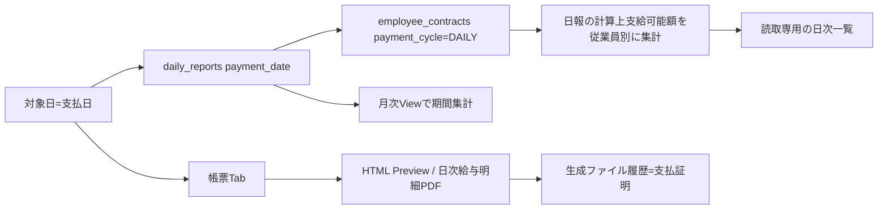

# 日次管理 画面からDB・帳票までの処理フロー V1

## 1. 全体像

## 2. 一覧生成

V1確定仕様では、同じ`payment_date`を持つ日報を従業員単位にまとめる。`daily_payments`の保存値を正本にはしない。

日報から新規候補を作る条件は次のとおり。

1. 日報の`payment_date`が対象日と一致する。
2. 従業員の契約情報`payment_cycle`が`DAILY`である。
集計額は日報に保存された計算上支給可能額の合計とする。実際の日次前払い額は常にこの金額と同額であり、別の実績額を入力しない。

## 3. 読取専用と訂正方法

日次管理画面には保存処理を置かない。金額・対象者・計算根拠に誤りがある場合は、正本である該当日報を修正し、日次給与明細を再発行して従業員へ渡す。

| method | path | 用途 |
|---|---|---|
| GET | 日次管理照会API | 対象支払日の日報を従業員単位に集計 |
| POST | なし | 日次管理からは保存しない |
| GET | 帳票Preview/Batch API | 最新日報の確認と支払証明の発行 |

現行の`/api/operation/daily-payments/bulk-save`は廃止済みである。`daily_payments`テーブルは既存DBとの互換性のため残すが、V1の日次・月次計算経路から隔離する。

## 4. 関連クラス

| クラス | 役割 |
|---|---|
| `DailyOperationPage.vue` | 対象日、概要・明細・帳票タブ |
| `useDailyOperationPage.ts` | 日報由来一覧、合計、帳票対象日の同期 |
| `DailyPaymentController` | 日次支払API |
| `DailyPaymentService` | 承認済み日報を支払日・従業員単位に集計する読取専用Service |
| `DailyPaymentRepository` | 旧`daily_payments`互換用。V1の日次管理からは未使用 |
| `DailyReportRepository` | 支払日一致の日報検索 |
| `EmployeeContractRepository` | 支払サイクル確認 |
| `OperationReportTab.vue` | 日次帳票Preview・出力 |

## 5. 帳票フロー

帳票タブは`operationType=DAILY`と対象日を共通Previewへ渡す。

- 日別労務費一覧：HTML Preview
- 給与支払表：HTML Preview/ブラウザ印刷
- 日次給与明細：HTML簡易Preview後、BatchでJasper PDFを生成してViewer表示
- その他PDF/CSV：定義の`jobCode`を実行

日次帳票は月次確定ファイル検索を使わず、操作時点のデータから生成する。

## 6. 「締め」の意味

日次管理には締めVersion、締め解除、締め後編集禁止を設けない。日報が計算の正本であり、日次給与明細PDFのBatch/生成ファイル履歴が発行時点の支払証明となる。訂正では旧ファイルを上書きせず、日報修正後に再発行履歴を追加する。月次は対象締め期間の日報を集計し、月次締めVersionで確定する。
