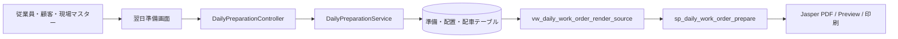
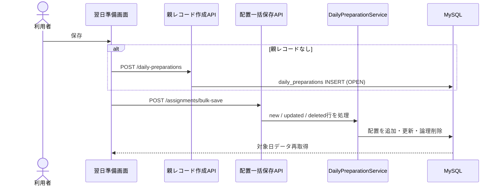
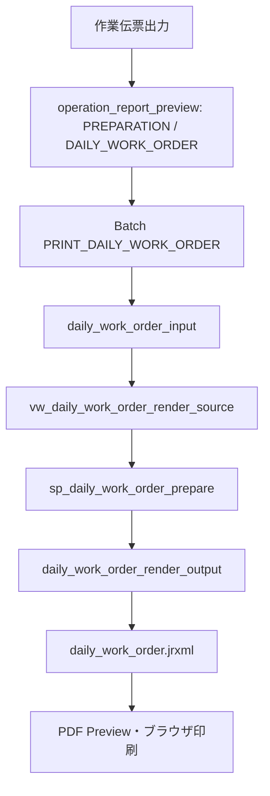

# 翌日準備 画面からDBまでの処理フロー V1

ドメイン：翌日準備

## 1. 目的

締め処理メニューの翌日準備について、対象日選択、従業員配置、現場配車、作業伝票PDFまでの現行処理を整理する。

画面は全体備考と次の3タブを持つ。

1. 従業員配置
2. 現場配車
3. 帳票

## 2. 全体構成



## 3. 対象日の取得

画面初期値はブラウザ日時の翌日である。対象日変更時に顧客・現場候補と対象日の翌日準備を取得する。

```text
DailyPreparationPage.vue
  -> useDailyPreparationQuery(targetDate)
  -> GET /api/operation/daily-preparations?targetDate=yyyy-MM-dd
  -> DailyPreparationService.findByTargetDate()
  -> daily_preparations
  -> daily_preparation_assignments
  -> daily_preparation_dispatches
```

対象日の親レコードがなければAPIは`null`を返し、画面には「翌日準備未作成」と表示する。入力を保存するまで空の親レコードは作らない。

全体備考は1000文字までのメモとして親レコードへ保存する。帳票・日報へは出力しない。

## 4. 従業員配置タブ

### 4.1 行の生成

`createAssignmentRows()`は従業員一覧を基準に、対象日の保存済み配置を重ねる。このため画面には配置済み・未配置を問わず従業員ごとに1行表示される。

編集項目：

- 顧客
- 現場
- 作業内容

従業員ID、社員コード、氏名は従業員マスターから取得する読み取り専用値である。

### 4.2 顧客・現場選択

顧客を変更すると現場選択をクリアする。現場を選ぶと、その現場の所属顧客を画面側で自動設定する。

顧客、現場、作業内容のいずれかが入力されると新規行として保存対象になる。既存行の全入力を消すと削除対象になる。

### 4.3 一括保存



サーバーは従業員、顧客、現場をIDから再取得し、コード・名称を配置テーブルへスナップショットする。

顧客と現場が同時指定された場合は、現場がその顧客に所属することをサーバーでも検証する。配置保存後、どの有効な配置からも使われなくなった現場の配車は論理削除する。

## 5. 現場配車タブ

### 5.1 行の生成

配車行は、従業員配置に含まれる現場IDの重複を除いて自動生成する。利用者が配車タブで現場を自由追加する構成ではない。

画面表示・編集：

- 顧客名：配置から自動設定、読み取り専用
- 現場名：配置から自動設定、読み取り専用
- 会社からの距離：現場マスターから表示、読み取り専用
- 配車台数：入力
- 備考：入力

### 5.2 一括保存

```text
配置から現場別配車行を生成
  -> 配車台数・備考を編集
  -> POST /api/operation/daily-preparations/dispatches/bulk-save
  -> 顧客・現場を再取得
  -> 現場のdistanceFromCompanyKmをSnapshot
  -> daily_preparation_dispatchesへ追加・更新・論理削除
```

配車台数が未指定の場合、サーバーは0を保存する。負数は画面とサーバーの双方で拒否する。

## 6. 日報への初期値連携

新規日報で勤務日・従業員を選択したとき、同日の翌日準備配置を取得する。

```text
新規日報で勤務日・従業員を選択
  -> GET /api/daily-reports/preparation-defaults
  -> daily_preparationsを勤務日で検索
  -> daily_preparation_assignmentsを準備ID＋従業員IDで検索
  -> 顧客・現場・作業内容を日報フォームの初期値へ反映
  -> 利用者が実績に合わせて編集して日報を保存
```

この連携は初期入力の補助だけである。日報を自動作成・自動保存せず、保存済み日報も上書きしない。従業員や勤務日を切り替えた場合、利用者が初期値を編集済みならその入力を優先する。

## 7. 親・子テーブルの保存単位

| テーブル | 一意条件 | 保存内容 |
|---|---|---|
| `daily_preparations` | テナント＋対象日 | 対象日、状態、全体備考 |
| `daily_preparation_assignments` | テナント＋準備ID＋従業員ID | 従業員別の顧客・現場・作業内容 |
| `daily_preparation_dispatches` | テナント＋準備ID＋現場ID | 現場別の距離、配車台数、備考 |

削除は`deleted_at`を設定する論理削除である。

## 8. 作業証明伝票

帳票タブは共通`OperationReportTab`を使用し、`operation-type="PREPARATION"`と対象日を渡す。



Viewは対象日・顧客・現場ごとに従業員を並べ、10人ごとに1ページへ分割する。Jasperへは1ページ分が横持ちになったoutputを渡す。

作業伝票に現在出力する値：

- 対象日・曜日
- 顧客・現場
- 従業員名（1〜10）
- 作業内容（1〜10）
- 会社からの距離
- 配車台数
- 自社名、電話、FAX

帳票マスターは`DAILY_WORK_ORDER`、ジョブは`PRINT_DAILY_WORK_ORDER`、出力形式はPDF、Preview有効である。

## 9. API一覧

| HTTP | API | 用途 |
|---|---|---|
| GET | `/api/operation/daily-preparations` | 対象日で親・配置・配車を取得 |
| POST | `/api/operation/daily-preparations` | 対象日の親レコードを作成 |
| PUT | `/api/operation/daily-preparations/{id}/note` | 全体備考を更新 |
| POST | `/assignments` | 配置1件作成 |
| PUT | `/assignments/{id}` | 配置1件更新 |
| DELETE | `/assignments/{id}` | 配置1件論理削除 |
| POST | `/assignments/bulk-save` | 画面が使用する配置一括保存 |
| POST | `/dispatches` | 配車1件作成 |
| PUT | `/dispatches/{id}` | 配車1件更新 |
| DELETE | `/dispatches/{id}` | 配車1件論理削除 |
| POST | `/dispatches/bulk-save` | 画面が使用する配車一括保存 |
| GET | `/api/daily-reports/preparation-defaults` | 勤務日・従業員に対応する日報初期値を取得 |

個別CRUD APIもあるが、現行画面は一括保存APIを使用する。

## 10. 主な関連クラス・モジュール

### フロントエンド

| モジュール | 役割 |
|---|---|
| `DailyPreparationPage.vue` | 対象日、3タブ、共通帳票タブの配置 |
| `useDailyPreparationPage.ts` | 親レコード遅延作成、配置・配車行、一括保存、Toolbar |
| `DailyPreparationAssignmentTable.vue` | 従業員配置表 |
| `useDailyPreparationAssignmentTableConfig.ts` | 全従業員と保存済み配置を行へ変換 |
| `DailyPreparationDispatchTable.vue` | 現場配車表 |
| `useDailyPreparationDispatchTableConfig.ts` | 配置現場から配車行を生成 |
| `OperationReportTab.vue` | 作業伝票Preview・PDF出力 |
| `useDailyReportEditDialog.ts` | 新規日報へ翌日準備の初期値を安全に反映 |

### バックエンド・DB資産

| クラス・資産 | 役割 |
|---|---|
| `DailyPreparationController` | 親・配置・配車API |
| `DailyPreparationService` | 取得、一括保存、マスターSnapshot、論理削除 |
| `DailyReportPreparationDefaultService` | 勤務日・従業員から日報初期値を取得 |
| `DailyPreparationMapper` | Entityからレスポンスへ変換 |
| `DailyPreparationRepository` | 対象日親レコード |
| `DailyPreparationAssignmentRepository` | 従業員配置 |
| `DailyPreparationDispatchRepository` | 現場配車 |
| `vw_daily_work_order_render_source` | 作業伝票用の顧客・現場・従業員・配車結合 |
| `sp_daily_work_order_prepare` | 10名/ページに平坦化してoutputへ保存 |
| `daily_work_order.jrxml` | 作業証明伝票レイアウト |
