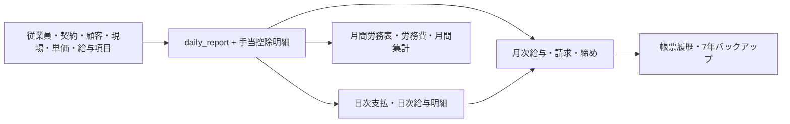

# 日報管理 入力項目の利用先・システム連携 V1

ドメイン：日報管理

## 1. 判定区分

| 区分 | 意味 |
|---|---|
| 利用中 | 計算、残高、請求、帳票、締め等から参照される |
| Snapshot | 保存時点のマスター値を日報へ複写し、後続処理が使用する |
| 表示用 | 画面の確認には使うが正本データ・後続処理ではない |
| 旧互換 | 現行の共通基盤に置換済みだが、カラム・requestが残る |
| 未連携 | 保存または表示されるが、想定した後続処理へ接続されない |

## 2. 日報データの業務上の位置



## 3. 基本・勤怠項目

保存先：`daily_report`

| 画面項目 | API / DB | 区分 | 利用先・連携 |
|---|---|---|---|
| 従業員 | `employeeId` / `employee_id` | 利用中 | 契約・給与Rule・従業員別手当控除・貸付貯蓄・給与明細・月次締めの主キー |
| 勤務日 | `workDate` / `work_date` | 利用中 | 同一従業員1日1件の重複判定、Rule適用日、単価適用日、月次対象期間、勤怠・請求・台帳 |
| 支払日 | `paymentDate` / `payment_date` | 利用中 | 日次給与明細を「支払日＋従業員」で集約し、日次支払との照合に使用 |
| 開始時刻 | `startTime` / `start_time` | 利用中 | 画面の勤務時間算出、Rule変数、勤怠表示 |
| 終了時刻 | `endTime` / `end_time` | 利用中 | 同上 |
| 休憩分 | `breakMinutes` / `break_minutes` | 利用中 | 画面の勤務時間算出、Rule変数。サーバーは0〜1440のみ検証 |
| 通常時間 | `workHours` / `work_hours` | 利用中 | 通常給Rule、週40時間判定、月次給与・請求・労務台帳 |
| 早出・残業時間 | `overtimeHours` / `overtime_hours` | 利用中 | 残業給Rule、月60時間判定、請求・給与明細・台帳 |
| 深夜時間 | `nightWorkHours` / `night_work_hours` | 利用中 | 深夜割増Rule、請求・給与明細・台帳。他時間と重複可能 |
| 休日手当対象 | `holidayPremiumEligible` / `holiday_premium_eligible` | 利用中 | 通常・残業時間を休日時間へ振替え、休日給Ruleへ渡す保存時点の判断 |
| 休日時間 | `holidayWorkHours` / `holiday_work_hours` | 利用中 | 休日給Rule、休日請求単価、月次帳票 |
| 作業内容 | `workDescription` / `work_description` | 利用中 | 日報表示、日別労務・帳票・業務確認 |
| 車両使用 | `vehicleUsedFlag` / `vehicle_used_flag` | 利用中 | 手当控除Rule変数、日報確認 |
| 走行距離 | `mileage` / `mileage` | 利用中 | 通勤請求単価×距離、Rule変数、請求・台帳 |
| 有給取得日数 | `paidLeaveDays` / `paid_leave_days` | 利用中 | 月次勤怠、月次給与明細・労務帳票。日報保存だけでは有給残を自動減算しない |

開始・終了・休憩から時間を計算する処理はフロントにあるが、サーバーは送られた時間を再算出しない。API直接呼出時も整合するよう、V1安定化ではサーバー検証が必要である。

## 4. 顧客・現場・請求項目

| 画面項目 | DBカラム | 区分 | 利用先・連携 |
|---|---|---|---|
| 顧客 | `customer_id`, `customer_name` | Snapshot | IDから顧客名を再取得。月次請求・日別労務・台帳の集計軸 |
| 現場 | `customer_site_id`, `site_name` | Snapshot | 顧客との所属関係を検証。請求単価解決、請求・台帳の集計軸 |
| 職種 | `job_code`, `job_name` | Snapshot | 現場別請求単価の検索キー、請求明細・帳票の分類 |
| 現場役職 | `site_role_code`, `site_role_name` | Snapshot | 請求単価の検索キー。未指定時は`GENERAL / 一般` |
| 適用単価ID | `billing_rate_id` | Snapshot | 保存時にサーバーが解決。過去単価の追跡 |
| 単価区分 | `billing_unit` | Snapshot | `DAILY` / `HOURLY`等の請求数量計算 |
| 基準単価 | `billing_base_unit_price` | Snapshot | 月次請求の通常金額 |
| 残業単価 | `billing_overtime_unit_price` | Snapshot | 残業請求額 |
| 深夜単価 | `billing_night_unit_price` | Snapshot | 深夜請求額 |
| 休日単価 | `billing_holiday_unit_price` | Snapshot | 休日請求額 |
| 通勤単価 | `billing_commute_unit_price` | Snapshot | 走行距離と掛けて通勤請求額 |

画面は単価をPreview表示するが保存requestへは単価値を含めない。正式値は必ずサーバーが再解決する。

## 5. 給与本体・概算額

利用者の直接入力ではなく、保存時にシステムが設定する。

| DBカラム | 区分 | 利用先・連携 |
|---|---|---|
| `normal_pay_amount` | 派生値 | 通常給Rule結果。月間労務表、月次給与明細等 |
| `overtime_pay_amount` | 派生値 | 早出・残業Rule結果。月次給与明細・台帳 |
| `night_pay_amount` | 派生値 | 深夜Rule結果。月次給与明細・台帳 |
| `holiday_pay_amount` | 派生値 | 休日Rule結果。月次給与明細・台帳 |
| `estimated_gross_pay_amount` | 派生値 | 給与本体＋手当合計。日報画面の概算 |
| `estimated_net_pay_amount` | 派生値 | 支給額－控除－貯蓄－返済。日報画面・日次Preview |

給与本体Ruleの割増基準値は現行JavaコードからRuleパラメーターへ渡している。Rule式は変更可能だが、週40時間、月60時間、週の起算日（月曜）、基準割増率は完全なマスター駆動ではない。

## 6. 手当・控除

保存先：`daily_report_allowances`、`daily_report_deductions`

| 明細項目 | 区分 | 利用先・連携 |
|---|---|---|
| マスターID | 利用中 | マスター・Policy・従業員設定・残高との関連キー |
| コード・名称 | Snapshot | 日報保存時点の表示名。帳票・月次項目コードによる集計 |
| 計算額 | 利用中 | Ruleまたは固定設定が算出した変更前金額。監査・比較 |
| 確定額 | 利用中 | 日報合計、給与明細、月次集計へ使う最終金額 |
| 手動変更 | 利用中 | `true`の場合、利用者入力額を採用 |
| 変更理由 | 利用中 | 手動変更時に必須。最大500文字 |
| 数量 | 利用中 | 日数・回数等の消化数量。Ruleへ`itemQuantity`として渡す |
| 残高単位 | Snapshot | 日数等の残高表示と数量検証 |

適用対象、入力元、計算方法、Rule、従業員別設定をマスターから解決する。`EMPLOYEE_ENROLLMENT`等の対象設定だけではなく、従業員側で有効期間とパラメーターが設定された項目が日報へ現れる。

日数残高を追跡する項目では、入力数量が残数量を超えないこと、日数が整数であることをサーバーで検証する。

## 7. 貸付・貯蓄

| 画面項目 | DBカラム | 区分 | 利用先・連携 |
|---|---|---|---|
| 貯蓄残高 | 保存しない | 表示用 | 従業員財務情報から取得した現在残高 |
| 借入残高 | 保存しない | 表示用 | 同上 |
| 実際貯蓄額 | `saving_amount` | 利用中 | 日報保存と同時に従業員貯蓄残高へ加算。月次給与から控除 |
| 実際返済額 | `loan_repayment_amount` | 利用中 | 従業員借入残高へ返済差分を反映。月次給与・残高表示 |

更新時は新旧差額、削除時は負の差額を適用するため、日報修正・削除でも残高整合性を維持する設計である。

## 8. 寮費日数

`dormitoryChargeDays` / `dormitory_charge_days`はrequestと日報本体に残るが、現行フォームには入力欄がない。

現在の正式経路は控除明細の`quantity`と残高共通基盤である。SQLには旧日報カラムから`DORMITORY_FEE`控除明細へ数量を移す移行処理があり、このカラムは旧互換として扱う。

## 9. 承認情報

| 項目 | 現状 |
|---|---|
| `approvalStatus` | request型にあるがサーバーは無視し、常に`APPROVED`で保存 |
| `approvalComment` | request型にあるがサーバーは無視し、常に`NULL` |

V1では承認フローを実装せず全件承認済みとする合意に沿った動作である。V2で承認フローを追加するまで画面入力項目としては使用しない。

## 10. 有給残

`paidLeaveRemainingDays`と`paidLeaveRemainingAfterUsedDays`は日報テーブルに保存しない表示用の派生値である。

```text
従業員給与プロフィールの有給残
  -> 日報詳細で表示
  -> 使用後残 = 現在残 - 当日日報の有給日数
```

日報作成・更新・削除に伴って従業員給与プロフィールの有給残を増減するCommandはない。月次画面も期間内使用日数を差し引いて表示するだけである。

## 11. 後続処理への主な連携

| 後続機能 | 日報から使う主な値 |
|---|---|
| 日次給与明細 | 支払日、従業員、給与本体、手当控除、残高 |
| 日別労務・給与支払Preview | 勤務日・支払日、従業員、時間、計算額 |
| 月次給与明細 | 締め期間、給与本体、日次前払い、手当控除、有給、貸付貯蓄 |
| 月次請求・顧客取引 | 顧客、現場、職種・役職、時間、単価Snapshot、距離 |
| 月間労務表・労務費一覧 | 勤務日、時間、給与本体、手当控除、有給 |
| 月間集計表 | 顧客・現場・従業員・勤務・請求情報 |
| 法定預り返金 | 日報控除明細の該当項目と月次期間 |
| バックアップ | 日報CSVおよび日報から生成した確定帳票 |
