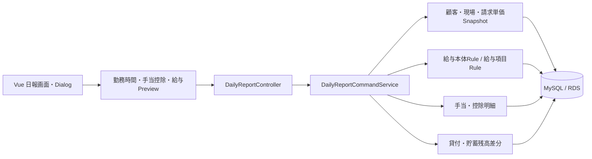
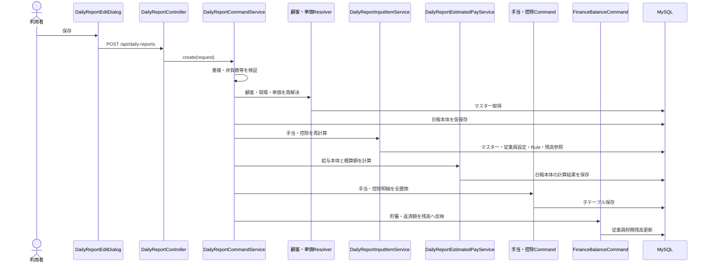

# 日報管理 画面からDBまでの処理フロー V1

ドメイン：日報管理

## 1. 目的

締め処理メニューの「日報入力」（本資料では日報管理と記載）について、画面操作からDB保存、Rule計算、残高更新までの現行実装を整理する。

日報画面は次の3タブを持つ。

1. 日報一覧
2. 未入力者
3. 月次勤怠

日報編集Dialogは次の5タブを持つ。

1. 基本情報
2. 請求情報
3. 手当
4. 控除
5. 貸付・貯蓄

## 2. 全体構成



日報保存では、クライアントが送った手当・控除合計や請求単価をそのまま信用しない。サーバーがマスター・Ruleから再解決し、保存値を確定する。

## 3. 日報一覧・詳細の取得

### 3.1 一覧

```text
DailyReportPage.vue
  -> useDailyReportsQuery
  -> GET /api/daily-reports
  -> DailyReportController.findAll()
  -> DailyReportQueryService.findAll()
  -> DailyReportRepository
  -> daily_report
```

APIは`from`、`to`、`employeeId`による絞込に対応する。ただし現行の画面Queryは引数なしで全件取得し、検索条件は主にフロント側で適用する。

### 3.2 詳細

```text
一覧行を選択
  -> GET /api/daily-reports/{id}
  -> DailyReportQueryService.findDetail()
  -> daily_report
  -> daily_report_allowances
  -> daily_report_deductions
  -> 従業員貸付・貯蓄・有給情報を表示用に付加
  -> DailyReportEditDialogへ反映
```

日報本体の手当・控除合計だけでなく、保存時点の明細スナップショットと手動変更理由も詳細レスポンスへ返す。

## 4. 新規作成時の画面処理

### 4.1 勤務時間

開始時刻、終了時刻、休憩時間、休日手当対象を変更すると、`dailyReportTimeCalculator`が通常・残業・深夜・休日時間を画面上で再計算する。

週末の日付を選んだ場合、画面の初期値は休日手当対象になる。ただし最終的には利用者が変更でき、サーバーは曜日だけで休日判定しない。

### 4.2 手当・控除Preview

```text
従業員・勤務時間・顧客・現場・数量等を変更
  -> debounce
  -> POST /api/daily-reports/input-items/preview
  -> DailyReportInputItemService.calculate()
  -> 適用対象マスターと従業員別設定を取得
  -> Rule変数とitemQuantityを構築
  -> 手当・控除Ruleを計算
  -> 残高・消化後残高を付加
  -> 画面の動的項目を置換
```

手動変更が許可された項目では、`manualOverride=true`の金額をRule計算結果より優先する。手動変更時は変更理由が必須である。

### 4.3 概算給与Preview

手当・控除Preview後に`POST /api/daily-reports/estimated-pay-preview`を呼ぶ。給与本体は`daily_pay_rule_setting`に登録された4種類のRuleを実行する。

- 通常給
- 早出・残業
- 深夜
- 休日

概算差引支給額は次式で返す。

```text
給与本体 = 通常給 + 早出・残業 + 深夜 + 休日
概算支給額 = 給与本体 + 手当合計
概算差引支給額 = 概算支給額 - 控除合計 - 貯蓄額 - 借入返済額
```

## 5. 日報新規登録



一連の処理は`@Transactional`で実行される。Ruleエラー、単価未設定、残高超過、明細保存失敗等が起きた場合は日報本体を含めてロールバックされる。

## 6. 顧客・現場・請求単価の保存

`DailyReportCustomerSiteResolver`はIDから顧客と現場を再取得する。画面から送られた`customerName`、`siteName`は正本ではない。

現場が指定された場合、現場の所属顧客とrequestの顧客が一致するか検証する。

`DailyReportBillingRateService`は次のキーで有効な単価を選ぶ。

```text
現場ID + 職種コード + 現場役職コード + 勤務日
```

決定した単価ID、職種、役職、単価区分、基準・残業・深夜・休日・通勤単価を`daily_report`へスナップショットする。月次請求は後から単価マスターを再参照せず、この保存値を使う。

## 7. 給与本体Rule計算

`DailyPayComponentCalculationService`は日報、雇用契約、当月の過去日報からRuleパラメーターを構築する。

主なパラメーター：

- 従業員ID、勤務日、支払日
- 通常・残業・深夜・休日時間
- 休日手当対象
- 週40時間超、月60時間以内・超過時間
- 給与区分、時給・日給・週給・月給、標準労働時間
- 計算用時給
- 顧客、現場、職種、役職、走行距離
- 法定割増率の基準値

Rule結果は0以上であることを検証し、円単位へ丸めて日報へ保存する。

## 8. 更新・削除

### 8.1 更新

更新時も顧客、単価、手当・控除、給与本体をすべて再計算する。子明細は差分更新ではなく、既存明細削除後に再登録する。

貸付・貯蓄は旧値との差額だけを残高へ反映する。従業員を変更した場合は、旧従業員から旧値を戻し、新従業員へ新値を反映する。

### 8.2 削除

日報は`deleted_at`を設定する論理削除である。削除前に、その日報が加算した貯蓄額・借入返済額を従業員残高から戻す。

手当・控除子明細は物理削除しないが、親日報が論理削除されるため通常の集計対象から外れる。

## 9. 未入力者タブ

```text
勤務日を指定
  -> GET /api/daily-reports/missing?workDate=...
  -> 全未削除従業員 - その日の登録済み従業員
```

現在は在籍期間、支払サイクル、勤務予定、休日・有給を判定せず、未削除の全従業員を基準にする。

## 10. 月次勤怠タブ

```text
対象月を指定
  -> GET /api/daily-reports/monthly-attendance?targetMonth=yyyy-MM
  -> 自社の給与締日から対象期間を解決
  -> 期間内の日報を従業員別に集計
  -> 勤務時間・有給・手当控除・貸付貯蓄・概算給与を表示
```

この画面の給与額は参照用の独自概算であり、保存済みの4種類の給与Rule結果を合算していない。正式な月次給与締め・給与明細とは別経路であるため、現状は「勤怠と概算の確認画面」として扱う。

## 11. API一覧

| HTTP | API | 用途 |
|---|---|---|
| GET | `/api/daily-reports` | 一覧・条件検索 |
| GET | `/api/daily-reports/{id}` | 詳細・手当控除明細 |
| POST | `/api/daily-reports` | 新規登録 |
| PUT | `/api/daily-reports/{id}` | 更新・再計算 |
| DELETE | `/api/daily-reports/{id}` | 論理削除 |
| GET | `/api/daily-reports/missing` | 未入力者 |
| GET | `/api/daily-reports/monthly-attendance` | 月次勤怠・概算 |
| POST | `/api/daily-reports/estimated-pay-preview` | 給与本体・差引概算 |
| GET | `/api/daily-reports/input-items` | 共通入力項目定義の取得 |
| POST | `/api/daily-reports/input-items/preview` | 従業員・日付別の手当控除計算 |

## 12. DBテーブル

| テーブル | 内容 |
|---|---|
| `daily_report` | 日報本体、勤怠、請求単価・給与計算結果スナップショット |
| `daily_report_allowances` | 日報ごとの手当明細、計算額、確定額、変更理由、数量 |
| `daily_report_deductions` | 日報ごとの控除明細、計算額、確定額、変更理由、数量 |
| `daily_pay_rule_setting` | 給与本体4区分とRule名の関連 |
| `allowance_master` / `deduction_master` | 動的手当・控除の正本 |
| `payroll_item_policy` | 適用対象、入力元、Rule、残高等の共通設定 |
| `employee_payroll_item_setting` | 従業員別の適用・Ruleパラメーター |
| `customer_site_billing_rates` | 現場別請求単価の解決元 |
| 従業員契約・財務系テーブル | 給与契約、借入・貯蓄残高、有給残を参照・更新 |

## 13. 主な関連クラス・モジュール

### フロントエンド

| モジュール | 役割 |
|---|---|
| `DailyReportPage.vue` | 3タブを持つ日報画面 |
| `DailyReportEditDialog.vue` | 日報の5タブ編集Dialog |
| `useDailyReportPage.ts` | CRUDとToolbar |
| `useDailyReportEditDialog.ts` | Form、Preview、契約・残高読込 |
| `useDailyReportFormFields.ts` | 基本・請求・財務項目定義 |
| `useDailyReportInputItems.ts` | 動的手当・控除の画面操作 |
| `dailyReportTimeCalculator.ts` | 開始終了時刻から勤務時間を算出 |
| `dailyReportConverters.ts` | Formから保存requestへ変換 |

### バックエンド

| クラス | 役割 |
|---|---|
| `DailyReportController` | 日報CRUD、未入力者、月次勤怠、給与Preview |
| `DailyReportInputItemController` | 動的手当・控除Preview |
| `DailyReportCommandService` | 保存処理全体のトランザクション制御 |
| `DailyReportSaveValidator` | 重複・必須・非負数等の検証 |
| `DailyReportCustomerSiteResolver` | 顧客・現場整合性と名称Snapshot |
| `DailyReportBillingRateService` | 適用請求単価の解決とSnapshot |
| `DailyReportInputItemService` | 手当控除Rule・残高・数量計算 |
| `DailyPayComponentCalculationService` | 給与本体4区分のRule計算 |
| `DailyReportEstimatedPayService` | 給与本体・概算支給額の保存 |
| `DailyReportAllowanceCommandService` | 手当明細の全置換と変更理由検証 |
| `DailyReportDeductionCommandService` | 控除明細の全置換と変更理由検証 |
| `DailyReportMonthlyAttendanceQueryService` | 月次勤怠タブの参照用集計 |
