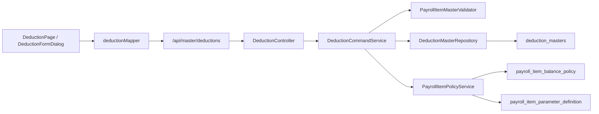
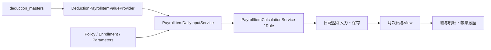

# 控除マスター管理 画面からDBまでの処理フロー V1

## 1. 目的

控除マスター画面の操作が、どのフロントエンド・API・Service・Repository・DBを通り、日報や給与計算へ接続するかを整理する。

## 2. 全体フロー



控除本体とPolicy・パラメーター定義は、同じ登録・更新トランザクションで同期する。

## 3. 一覧取得

```text
DeductionPage.vue
  -> useDeductionsQuery()
  -> GET /api/master/deductions
  -> DeductionController.findAll()
  -> DeductionQueryService.findAll()
  -> DeductionMasterRepository
  -> deduction_masters
  -> display_order, id順で返却
```

一覧APIは控除本体だけを返す。Policyと動的パラメーターは、行選択後の詳細APIで取得する。

## 4. 詳細取得

```text
一覧行を選択
  -> GET /api/master/deductions/{id}?targetDate=YYYY-MM-DD
  -> DeductionQueryService.findDetail()
  -> deduction_masters
  -> DeductionDetailResolver
  -> PayrollItemPolicyService.find()
  -> DeductionDetailResponse
  -> DeductionFormDialog
```

`targetDate`未指定時は注入された`Clock`の現在日を使う。詳細種別に応じて税・保険マスターの有効期間データも解決する。

### 詳細種別

| `detailViewType` | 主な参照先 | 用途 |
|---|---|---|
| `NONE` | なし | 一般控除 |
| `INCOME_TAX` | 所得税テーブル | 給与額・扶養人数に対応する税額確認 |
| `RESIDENT_TAX` | 住民税データ | 従業員別住民税の確認・編集機能への接続 |
| `HEALTH_INSURANCE` | 保険料率・標準報酬 | 健康保険関連データ確認 |
| `PENSION` | 保険料率・標準報酬 | 厚生年金関連データ確認 |
| `EMPLOYMENT_INSURANCE` | 保険料率 | 雇用保険関連データ確認 |

## 5. 登録・更新

| 操作 | API | Backend |
|---|---|---|
| 新規登録 | `POST /api/master/deductions` | `DeductionCommandService.create()` |
| 更新 | `PUT /api/master/deductions/{id}` | `DeductionCommandService.update()` |

処理順は次のとおり。

1. Request DTOのBean Validation
2. `PayrollItemMasterValidator`によるコード・計算方式・金額範囲・Rule検証
3. コードを大文字へ正規化
4. 新規時は同一テナント内コード重複検証
5. 更新時はコード変更を拒否
6. `DeductionMapper`でEntityへ反映
7. `deduction_masters`を保存
8. `PayrollItemPolicyService.synchronize()`でPolicyとパラメーター定義を同期

### 計算方式の検証

| 計算区分 | 必須条件 |
|---|---|
| `MANUAL` | `allowManualInput=true` |
| `FIXED` | `defaultAmount`必須 |
| `AUTO` | 有効な`DEDUCTION`または`GENERAL` Rule名が必須 |

最小・最大・既定額・表示順は負数不可で、最小額は最大額以下でなければならない。

## 6. 削除

```text
DELETE /api/master/deductions/{id}
  -> enabled=false
  -> deleted_at=現在時刻
```

物理削除ではない。以後の一覧・日報候補・従業員別設定候補から除外される。Policyは削除していないため、履歴参照との整合性は維持される。

## 7. 日報計算への接続



日報候補になる基本条件は次のすべてである。

- `enabled=true`
- `showOnDailyStatement=true`
- `deductionUnit`が`DAILY`または`BOTH`
- Policyの適用対象と入力元の条件を満たす
- `EMPLOYEE_ENROLLMENT`の場合は対象日に有効な従業員別適用がある

`TRANSACTION`入力の項目は日報候補から除外され、従業員別の汎用控除取引から月次へ連携する。

## 8. 主な関連クラス

| 層 | クラス・ファイル | 役割 |
|---|---|---|
| Page | `DeductionPage.vue` | 一覧、選択、Dialog、CRUD制御 |
| Form | `DeductionFormDialog.vue` | 基本・計算・表示・Policy・詳細タブ |
| Fields | `useDeductionFormFields.ts` | 控除本体のフォーム定義 |
| Policy UI | `PayrollItemPolicyEditor.vue` | 適用対象、入力元、残高、動的パラメーター |
| Mapper | `deductionMapper.ts` | APIと画面modelの相互変換 |
| API hooks | `useDeductionsQuery.ts`等 | TanStack QueryによるCRUD |
| Controller | `DeductionController` | 権限・HTTP endpoint |
| Command | `DeductionCommandService` | 登録、更新、論理削除 |
| Query | `DeductionQueryService` | 一覧、詳細、詳細種別、Policy取得 |
| Validator | `PayrollItemMasterValidator` | 共通給与項目検証 |
| Policy | `PayrollItemPolicyService` | Policy・パラメーター定義同期 |
| Provider | `DeductionPayrollItemValueProvider` | 計算用snapshotと候補取得 |
| Daily | `PayrollItemDailyInputService` | 日報入力modeと編集可否の決定 |
| Calculation | `PayrollItemCalculationService` | Rule計算、手動変更、上下限、丸め |

## 9. DBテーブル

| テーブル | 内容 |
|---|---|
| `deduction_masters` | 控除名、区分、計算、表示設定 |
| `payroll_item_balance_policy` | 適用対象、入力元、残高Policy |
| `payroll_item_parameter_definition` | 従業員別・Rule用の動的項目定義 |
| `employee_payroll_item_enrollment` | 従業員への適用期間 |
| `employee_payroll_item_setting` | 従業員別パラメーター値 |
| `employee_payroll_item_transaction` | 明細到着型等の汎用控除取引 |
| `daily_report_deductions` | 日報で確定した控除値 |

## 10. 権限

- 参照：`master:view`
- 登録・更新・削除：`master:manage`
- テナントは`TenantContext`で分離する。
