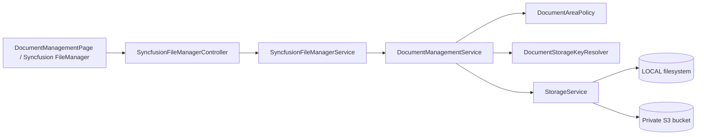

# 書類管理 画面からLOCAL/S3までの処理フロー V1

ドメイン：書類管理

## 1. 全体構成



画面と全APIは`SYS_ADMIN`専用である。FileManagerはlocalStorageのアクセストークンをAuthorizationヘッダーへ設定し、現在は`X-Tenant-ID: default`も固定送信する。

## 2. 書類領域と操作権限

| 領域 | ルートキー | 画面操作 |
|---|---|---|
| 会社書類 `GENERAL` | `documents/general` | 全操作 |
| 生成帳票 `GENERATED_REPORTS` | `documents/generated-reports` | 参照・検索・詳細・DL |
| バックアップ `BACKUPS` | `documents/backups` | 参照・検索・詳細・DL |
| テンプレート `TEMPLATES` | `documents/templates` | 参照・検索・詳細・DL |
| 取込スクリプト `IMPORT_SCRIPTS` | `imports/scripts` | 全操作、`.py/.sh`のみ |

権限はFrontend表示だけでなく、`DocumentAreaPolicy.requireAllowed()`によりBackendでも検証される。

## 3. FileManager操作

| FileManager action | Backend処理 |
|---|---|
| read | ディレクトリ直下を最大1000件ずつ全ページ取得 |
| create | 同名確認後、フォルダ作成 |
| upload | ファイル名・容量・領域固有拡張子を検証し、同名がなければ保存 |
| rename | コピー後に元を削除 |
| copy | ファイルコピー、フォルダは配下を再帰コピー |
| move | コピー成功後に元を再帰削除 |
| delete | ファイル削除、フォルダは深いキーから再帰削除 |
| search | 領域全体を再帰一覧し、名前の部分一致をアプリ内検索 |
| details | 名前、パス、合計サイズ、更新日時、権限を返す |
| download | 単一ファイルはstream、複数・フォルダはZIPをstream |

upload、コピー、移動、名称変更は操作先に同名があると拒否する。領域ルート自体は変更・削除・ダウンロードできない。フォルダーDownload判定はブラウザーから渡された`isFile`だけに依存せず、サーバー側の保存状態を正本とする。

## 4. 保存先の切替

`project.storage.default-type`で新規保存先を選択する。

### LOCAL

- 既定ベース：`storage`
- 解決後Pathがベース配下から外れないことを検証する。
- 保存時は親ディレクトリを作り、同一名を置換する。

### S3

- `project.storage.s3.enabled=true`のときBackendを登録する。
- Bucketは非公開、Public Access Block有効、BucketOwnerEnforced、AES256暗号化、Versioning有効。
- アプリはEC2ロールのIAM PolicyでList/Get/Put/Delete等を実行する。
- 利用者へS3 URLを直接公開せず、Spring Bootがファイルをstreamする。

## 5. パス安全性

`DocumentStorageKeyResolver`は先頭・末尾`/`を除去し、`.`、`..`、制御文字を拒否する。名称には`/`、`\`、`.`、`..`、制御文字を許可しない。

LOCAL Backendでも最終Pathをnormalizeし、ベースPath外への脱出を拒否する。S3キーも同じResolverを通す。

## 6. 下流機能との連携

### 6.1 生成帳票

帳票基盤の既定出力先`documents/generated-reports/reports`は生成帳票領域の配下である。書類管理では参照・ダウンロードのみ可能で、帳票履歴・生成ロジックの正本は帳票管理側にある。

### 6.2 年度帳票・システムバックアップ

- 年度帳票：`documents/backups/reports/...`
- システムバックアップZIP：`BackupFileStorageService`がバックアップ領域へ保存

書類管理は保存済み成果物を直接参照するが、バックアップの実行状態や保持期限は各バックアップテーブルが正本である。

### 6.3 テンプレート

帳票テンプレート既定パス`documents/templates/reports`等を一覧できる。現ポリシーでは書類管理から更新できず、帳票・台帳管理、初期化処理、デプロイ資産等が書込主体となる。

### 6.4 取込スクリプト

```text
書類管理で.py/.shをimports/scriptsへ登録
  -> 外部データ取込マスターのscriptPathで選択・指定
  -> ImportScriptPathResolver
     LOCAL: 指定ディレクトリから直接取得
     S3: 作業ディレクトリへ一時展開
  -> ImportScriptExecutorServiceがpythonまたはshで実行
```

同梱税率・税額変換スクリプトは、初期化機能が有効な場合に存在しないファイルだけをLOCAL/S3へ配置する。管理者が更新済みの同名ファイルは上書きしない。

## 7. API

Syncfusion画面が直接使う主なAPI：

| HTTP | API | 用途 |
|---|---|---|
| GET | `/api/admin/documents/areas` | 領域と許可操作 |
| POST | `/api/admin/documents/file-manager/{area}/operations` | read/create/delete/rename/copy/move/search/details |
| POST | `/api/admin/documents/file-manager/{area}/upload` | 複数アップロード |
| POST | `/api/admin/documents/file-manager/{area}/download` | ファイル・ZIPダウンロード |

このほか、FileManager非依存の一覧・検索・DL・作成・upload・copy・move・rename・delete REST APIも`DocumentManagementController`が公開する。

書類の変更操作とdownloadは、利用者・Tenant・領域・相対パス・成否をアプリケーションログへ記録する。AWS環境ではCloudWatch Logsが監査確認先となる。

## 8. 主な関連クラス

| 層 | クラス・モジュール | 役割 |
|---|---|---|
| Frontend | `DocumentManagementPage.vue` | 5領域、Syncfusion設定、認証Header、通知 |
| Backend | `SyncfusionFileManagerController` | Syncfusion通信形式のEndpoint |
| Backend | `SyncfusionFileManagerService` | FileManager request/response変換、ZIP生成 |
| Backend | `DocumentManagementController` | UI非依存の書類REST API |
| Backend | `DocumentManagementService` | 書類操作と検証 |
| Backend | `DocumentAreaPolicy` | 領域別操作許可 |
| Backend | `DocumentStorageKeyResolver` | 論理領域から安全な保存キーへ変換 |
| Storage | `StorageService` | LOCAL/S3 Backend選択 |
| Storage | `LocalStorageService` | ローカルファイル実装 |
| Storage | `S3StorageService` | AWS S3実装 |
| Downstream | `ReportStorageService` | 帳票テンプレート・生成帳票 |
| Downstream | `AnnualReportBackupService` | 年度帳票をバックアップ領域へコピー |
| Downstream | `ImportScriptPathResolver` | 取込スクリプトをLOCAL/S3から解決 |
