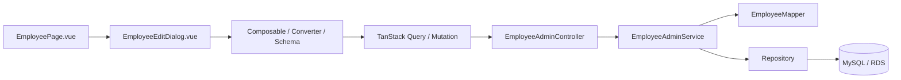

# 従業員管理 画面からDBまでの処理フロー V1

ドメイン：従業員管理

## 1. 対象

従業員情報画面`/employee/information`について、一覧、詳細、新規登録、更新、退職、退職取消、削除、手当・控除設定の処理を整理する。

次は対象外とする。

- 従業員貸付・貯蓄
- 日報の登録・給与計算
- 月次締め・給与明細生成
- 旧`EmployeeTimesheet`機能

## 2. 全体構成



## 3. 一覧・詳細

### 3.1 一覧

```text
EmployeePage.vue
  -> useEmployeePage
  -> useEmployeesQuery
  -> GET /api/employees
  -> EmployeeAdminController.findAll
  -> EmployeeAdminService.findAll
  -> EmployeeRepository
  -> employee
  -> EmployeeMapper.toListItemResponseList
```

一覧は`employee`をID昇順で取得し、論理削除済みを除外する。

### 3.2 詳細

```text
一覧行クリック
  -> useEmployeeDialog.openEdit
  -> useEmployeeDetailQuery
  -> GET /api/employees/{id}
  -> EmployeeAdminService.findDetail
  -> employee
  -> employee_payroll_profile
  -> employee_contract
  -> EmployeePayrollItemSettingService.findAll
  -> EmployeeDetailResponse
  -> employeeFormFactory.toEmployeeForm
```

詳細Dialogは次の4タブを持つ。

1. 基本情報
2. 手当・控除設定
3. 給与・税金
4. 契約情報

## 4. 新規登録

```text
新規作成
  -> createEmptyEmployeeForm
  -> EmployeeEditDialogで入力
  -> validateEmployeeForm
  -> employeeConverters.toEmployeeSaveRequest
  -> POST /api/employees
  -> EmployeeAdminService.create
  -> サーバー入力検証・社員コード重複検証
  -> employee INSERT
  -> employee_payroll_profile INSERT
  -> employee_contract INSERT
  -> employee_payroll_item_enrollment同期
  -> 詳細レスポンス
```

新規登録時の在籍状態は必ず`ACTIVE`、退職日は`NULL`、`active_flag`はtrueとなる。画面Requestの値をそのまま採用せず、`Employee.initializeEmployment()`が初期状態を確定する。

社員コードはテナント内で一意であり、作成後は変更できない。

## 5. 更新

```text
従業員編集Dialogで保存
  -> PUT /api/employees/{id}
  -> EmployeeAdminService.update
  -> 社員コード不変・退職済みでないことを検証
  -> EmployeeMapperで基本情報更新
  -> employee_payroll_profileを更新または新規作成
  -> employee_contractを更新または新規作成
  -> payment_cycleから旧daily_pay_flagを同期
  -> EmployeePayrollItemSettingService.synchronizeAll
  -> employee更新
```

通常更新から`RESIGNED`へ変更することはできない。退職は専用処理を使用する。

## 6. 手当・控除設定

### 6.1 カタログ取得

```text
GET /api/employees/payroll-item-settings/catalog
  -> EmployeePayrollItemSettingService.findCatalog
  -> payroll_item_balance_policy
  -> allowance_master / deduction_master
  -> payroll_item_parameter_definition
```

表示対象は次をすべて満たす給与項目である。

- Policyが有効
- `application_scope = EMPLOYEE_ENROLLMENT`
- 対応する手当・控除マスターが有効

したがって、従業員画面へ寮費等を個別に直書きするのではなく、Policy・マスター・パラメーター定義を通じて動的に表示する。

### 6.2 従業員別設定の保存

```text
EmployeePayrollItemSettingsPanel
  -> payrollItemSettings[]
  -> EmployeeSaveRequest
  -> EmployeePayrollItemSettingService.synchronizeAll
  -> PayrollItemEnrollmentService.synchronize
  -> employee_payroll_item_enrollment
```

設定値は`settings_json`へ保存される。パラメーター入力欄は`payroll_item_parameter_definition`から生成する。

### 6.3 日報・残高への連携

有効期間内の従業員別設定は、日報の動的項目、Ruleパラメーター、入力元判定、残高照会に利用される。

```text
employee_payroll_item_enrollment
  + payroll_item_balance_policy
  + parameter definitions
  -> EmployeePayrollItemSettingService
  -> 日報入力候補 / Ruleパラメーター
  -> 日報保存
  -> 残高・月次給与処理
```

## 7. 退職・退職取消

### 7.1 退職

```text
退職ボタン
  -> 退職設定・TODO取得
  -> POST /api/employees/{id}/resign
  -> 必須チェック項目検証
  -> Employee.resign
  -> resign_date保存
  -> employment_status = RESIGNED
  -> active_flag = false
```

退職日は入社日以降である必要がある。退職TODOは業務管理の退職設定を参照する。

### 7.2 退職取消

`POST /api/employees/{id}/cancel-resignation`で退職日を消し、在籍状態を`ACTIVE`へ戻す。

## 8. 削除

```text
DELETE /api/employees/{id}
  -> EmployeeDeletionPolicy.verifyDeletable
  -> employee.deleted_at
  -> employee_payroll_profile.deleted_at
  -> employee_contract.deleted_at
```

参照されている従業員は削除Policyにより拒否される。削除は論理削除であり、社員コードの再利用可否はRepositoryの`deleted_at IS NULL`条件に依存する。

## 9. 画面で使用するAPI

| HTTP | API | 用途 |
|---|---|---|
| GET | `/api/employees` | 一覧・各従業員選択肢 |
| GET | `/api/employees/{id}` | 詳細、給与・税金、契約、個別給与項目設定 |
| GET | `/api/employees/payroll-item-settings/catalog` | 新規従業員用の動的設定カタログ |
| POST | `/api/employees` | 新規登録 |
| PUT | `/api/employees/{id}` | 通常更新 |
| DELETE | `/api/employees/{id}` | 論理削除 |
| GET | `/api/employees/resignation-checklist` | 退職TODO |
| GET | `/api/employees/resignation-configuration` | 退職時文言・設定 |
| POST | `/api/employees/{id}/resign` | 退職 |
| POST | `/api/employees/{id}/cancel-resignation` | 退職取消 |

## 10. 主なDBテーブル

| テーブル | 内容 |
|---|---|
| `employee` | 基本情報・在籍状態 |
| `employee_payroll_profile` | 税・保険・有給・通勤手当設定 |
| `employee_contract` | 給与形態・支払サイクル・賃金・契約期間 |
| `employee_payroll_item_enrollment` | 従業員別の動的手当・控除設定 |
| `payroll_item_balance_policy` | 適用範囲・入力元・残高追跡Policy |
| `payroll_item_parameter_definition` | 動的設定フォーム・Ruleパラメーター定義 |
| `employee_payroll_item_transaction` | 明細到着型などの給与項目取引 |
| `employee_resignation_setting` | 退職時文言・設定 |
| `employee_resignation_checklist_master` | 退職TODOマスター |

## 11. 主な関連クラス

### フロントエンド

| ファイル | 役割 |
|---|---|
| `EmployeePage.vue` | 一覧画面とDialog配置 |
| `useEmployeePage.ts` | 一覧CRUD・CSV・帳票・取込Toolbar |
| `EmployeeEditDialog.vue` | 4タブの編集Dialog |
| `useEmployeeEditDialog.ts` | 項目定義、タブ、保存・退職操作 |
| `EmployeePayrollItemSettingsPanel.vue` | 動的手当・控除設定 |
| `PayrollItemTransactionPanel.vue` | 取引型給与項目の明細管理 |
| `employeeFormFactory.ts` | API詳細から画面Formへ変換 |
| `employeeConverters.ts` | 画面Formから保存Requestへ変換 |
| `employeeSchemas.ts` | フロント入力検証 |

### バックエンド

| クラス | 役割 |
|---|---|
| `EmployeeAdminController` | 従業員CRUD・退職API |
| `EmployeeAdminService` | 保存トランザクションと業務検証 |
| `EmployeeMapper` | Entity・DTO更新と初期値補完 |
| `EmployeeDeletionPolicy` | 削除前の参照検証 |
| `EmployeePayrollItemSettingService` | 動的給与項目のカタログ・従業員設定・Rule連携 |
| `PayrollItemEnrollmentService` | 適用期間付き従業員設定の同期 |
