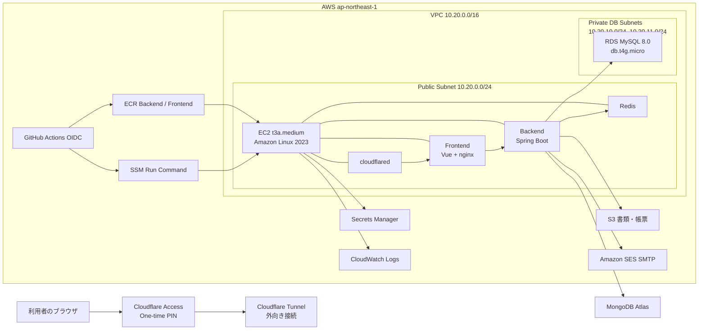

# 01. 現行構成とインフラ基礎

## 1. 最初に理解すること

ProjectAdminSystemは、AWSの各サービスを個別に手作業でつなぐ構成ではない。TerraformでAWSとCloudflareの土台を作り、その上でDocker Composeがアプリケーションを動かす。

役割を短く分けると次のとおりである。

- **AWS**: サーバー、DB、ストレージ、コンテナ保管、監視、メール送信を提供する
- **Terraform**: AWSとCloudflareの構成をコードとして作成・変更・記録する
- **Docker**: アプリと必要なミドルウェアを同じ実行形式で動かす
- **GitHub Actions**: テスト、イメージ作成、AWSへのデプロイを自動化する
- **Cloudflare**: インターネットからEC2へ受信ポートを開けずに、安全な公開URLと利用者認証を提供する
- **MongoDB Atlas**: MongoDBをAWS EC2外のマネージドサービスとして提供する

## 2. 基本用語

### 2.1 AWSリージョンとAZ

リージョンはAWSの地理的な拠点である。このシステムは東京リージョン `ap-northeast-1` に統一する。

AZ（Availability Zone）は、同じリージョン内で分離された設備群である。
RDS用サブネットを2つのAZへ置くのは、RDSのサブネットグループ要件と将来の可用性拡張に備えるためである。
現在のRDS自体は費用を抑えるためSingle-AZである。

### 2.2 VPC、Subnet、Route Table

- **VPC**: AWS上に作るシステム専用の仮想ネットワーク
- **Subnet**: VPCを用途やAZごとに分割した範囲
- **Route Table**: 通信をどこへ送るかを定める経路表
- **Internet Gateway**: VPCからインターネットへ出るための出入口

EC2はパブリックサブネットに置くが、アプリ用の受信ポートは開けない。RDSはプライベートサブネットに置き、インターネットから直接接続できない。

### 2.3 Security Group

Security Groupはリソース単位の仮想ファイアウォールである。

- EC2用Security Group: 外向き通信を許可し、アプリ・SSHの受信ポートは公開しない
- RDS用Security Group: EC2用Security GroupからのMySQL `3306` だけを許可する

IPアドレスではなくSecurity Group同士を関連付けるため、EC2の内部IPが変わってもDB接続ルールを作り直さずに済む。

### 2.4 IAM、Role、Policy

- **IAM**: 「誰が」「何をできるか」を管理する仕組み
- **Role**: EC2やGitHub Actionsが一時的に引き受ける権限のまとまり
- **Policy**: 許可する操作と対象リソースを定義した文書

EC2へAWSアクセスキーを保存しない。EC2 Instance RoleからS3、ECR、Secrets Manager、CloudWatchへ必要最小限の一時権限を取得する。

### 2.5 EC2、RDS、S3、ECR

- **EC2**: Dockerコンテナを動かす仮想サーバー
- **RDS**: AWS管理のMySQL。OS管理、バックアップ、暗号化をAWSに任せる
- **S3**: 書類、帳票、テンプレート、バックアップをオブジェクトとして保存する
- **ECR**: BackendとFrontendのDockerイメージを保存するプライベートレジストリ

### 2.6 Secrets Manager、SSM、CloudWatch、SES

- **Secrets Manager**: DBパスワード、JWT、MongoDB URIなどの秘密値を保管する
- **Systems Manager（SSM）**: SSHポートやSSH鍵を使わずEC2へ接続・コマンド実行する
- **CloudWatch**: コンテナログ、EC2・RDSのメトリクス、アラーム、ダッシュボードを管理する
- **SES**: システムメールを送るAWSサービス

Session Managerは受信ポートや踏み台サーバーを必要としないため、本構成ではSSHを使わない。[AWS公式: Session Manager](https://docs.aws.amazon.com/systems-manager/latest/userguide/session-manager.html)

### 2.7 Dockerの用語

- **Dockerfile**: イメージの作り方
- **Image**: アプリと実行環境をまとめた変更不可の配布物
- **Container**: Imageを実際に起動したプロセス
- **Volume**: コンテナを作り直しても残すデータ領域
- **Docker Compose**: 複数コンテナの関係、環境変数、Volume、Networkを1つのYAMLで管理する仕組み

### 2.8 Terraformの用語

- **Configuration**: `.tf` に記述した望ましい構成
- **State**: Terraformが管理している実リソースとの対応表。秘密情報を含む可能性がある
- **init**: ProviderとBackendを準備する
- **validate**: Terraform構文と設定の整合性を検査する
- **plan**: 何を追加・変更・削除するかを事前表示する
- **apply**: 承認したplanを実際に反映する
- **destroy**: 管理資産を削除する。通常運用では実行しない

Terraform stateをS3へ置くと、PC故障時にも管理情報を失わず、同時変更をLockで防げる。S3 BackendではVersioningと`use_lockfile`が推奨される。[HashiCorp公式: S3 Backend](https://developer.hashicorp.com/terraform/language/backend/s3)

## 3. 現在の全体構成

## 4. Terraformが作る主な資産

| 分類 | 現行値・構成 | 目的 |
|---|---|---|
| Region | `ap-northeast-1` | 東京リージョンへ統一 |
| VPC | `10.20.0.0/16` | ProjectAdmin専用ネットワーク |
| App Subnet | `10.20.0.0/24`, `1a` | EC2配置 |
| DB Subnets | `10.20.10.0/24` `1a`, `10.20.11.0/24` `1c` | RDS配置 |
| EC2 | Amazon Linux 2023 x86_64, `t3a.medium`, gp3 30GiB | Docker Runtime |
| EIP | EC2へ1個 | MongoDB Atlas許可IPの固定 |
| RDS | MySQL `8.0.46`, `db.t4g.micro`, 20GiB、最大50GiB | 業務DB |
| RDS Backup | 7日、暗号化、削除保護 | 短期復旧 |
| S3 | 書類用1バケット | 書類、帳票、テンプレート、バックアップ |
| ECR | Backend / Frontend各1 | Docker Image |
| ECR Lifecycle | 最新10個、untagged 7日 | 保存費用抑制 |
| Secrets | DBアプリ用、Runtime用 | 秘密値をGitから分離 |
| CloudWatch Logs | `/project-admin/dev/runtime`, 14日 | 4コンテナのログ |
| CloudWatch Alarm | Backend ERROR、EC2 Status、RDS空き容量 | 障害検知 |
| SES | ドメインIdentity、DKIM、SMTP IAM User | メール送信 |
| GitHub OIDC Role | Environment `dev` のみ信頼 | 長期AWSキーなしのデプロイ |
| Cloudflare | Tunnel、DNS、Access、OTP | 非公開Originの安全な公開 |

`ecs_task_execution_iam`も現在のstateに残っているが、アプリの実行基盤はECSではなくEC2 Docker Composeである。V1再構築ではコードどおり作成されるが、将来の整理候補である。

## 5. EC2上のDocker構成

| Container | Image | 公開 | 主な役割 |
|---|---|---|---|
| `cloudflared` | `cloudflare/cloudflared:2026.7.2` | 外向きTunnelのみ | CloudflareからFrontendへ接続 |
| `frontend` | Private ECR | Compose内部 `8080` | Vue配信、`/api`と`/auth`をBackendへProxy |
| `backend` | Private ECR | EC2 localhost `127.0.0.1:8080` のみ | Spring Boot API |
| `redis` | `redis:7.4-alpine` | Compose内部のみ | Cache・短期状態 |

すべて同じDocker Network `project-admin-dev-application` 上で名前解決する。CloudflareのOriginが `http://frontend:8080` なのはこのためである。

## 6. ローカル環境との差

| 項目 | ローカル | AWS DEV |
|---|---|---|
| 起動 | `docker-compose.yml` | `infrastructure/runtime/dev/compose.yaml` |
| MySQL | Docker MySQL 8.4 | RDS MySQL 8.0 |
| MongoDB | Docker MongoDB 7 | MongoDB Atlas |
| Redis | 永続Volumeあり | Cache用途、永続化なし |
| Mail | Mailpit、外部送信なし | Amazon SES SMTP |
| Storage | Docker VolumeのLOCAL | S3 |
| Frontend URL | `http://localhost:5173` | Cloudflare Access配下のHTTPS URL |
| DB Schema | Hibernate update＋追加SQL | 初回bootstrap後はHibernate validate |
| Log | ローカル標準出力・ファイル | CloudWatch awslogs |

## 7. 費用の考え方

この構成で継続的に費用が発生しやすいのは、EC2、RDS、EBS、RDS Storage、Elastic IP、S3、CloudWatch Logs、Secrets Manager、MongoDB Atlas、ドメインである。

EC2とRDSを停止するとCompute時間は抑えられるが、次は停止中も残る。

- EC2のEBS Volume
- Elastic IPの料金対象部分
- RDS StorageとBackup/Snapshot
- S3 Objects
- ECR Images
- Secrets Manager Secrets
- CloudWatch Logs
- Cloudflareで取得したドメイン更新料
- MongoDB Atlasの契約プラン

RDSは停止後7日で自動起動する。DEV環境を長期間使わない場合も定期確認が必要である。[AWS公式: RDSの一時停止](https://docs.aws.amazon.com/AmazonRDS/latest/UserGuide/USER_StopInstance.html)

価格はリージョン、為替、無料枠、クレジット、使用量で変わるため、この文書へ固定金額を書かず、構築前と月1回にAWS Pricing CalculatorとCost Explorerで確認する。

## 8. セキュリティ上の要点

- EC2のSSH `22`、Backend `8080`、Frontend `8080`をインターネットへ開けない
- RDSをPublicにしない
- rootユーザーを日常利用しない
- rootアクセスキーと個人用の長期AWSアクセスキーを作らない
- GitHub ActionsはOIDCの一時認証だけを使う
- EC2はInstance Roleから一時権限を受ける
- Secretsを環境変数一覧やDocker Image Layerへ焼き込まない
- Terraform planとstateをGitへ登録しない
- S3のPublic Access Blockを解除しない
- Cloudflare Accessの許可メールを必要な利用者だけにする
