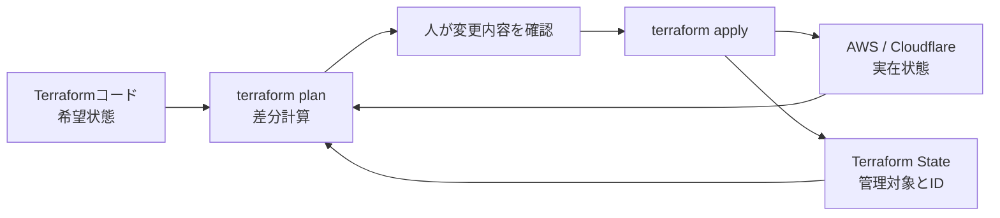
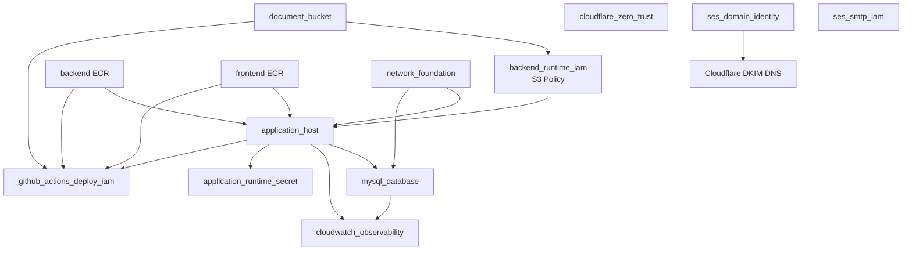
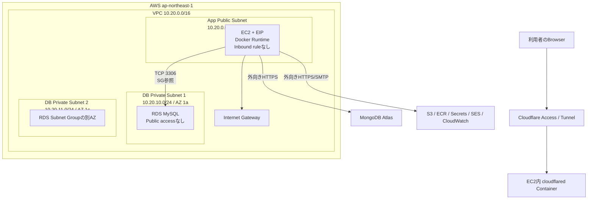

# 03-A. Terraform実装・文法・ネットワーク詳細解説

## 1. この文書の位置づけ

この文書は、[03-terraform-build-procedure.md](03-terraform-build-procedure.md) の補足資料である。

- `03-terraform-build-procedure.md`: 実際に構築・変更するときの作業手順
- 本書: ProjectAdminSystemのTerraformコードが何を意味し、AWS上でどう連携するかを理解するための解説

既存の03は削除せず、構築作業では03、設計確認・コードリーディング・変更影響の調査では本書を併用する。

対象読者はTerraform、AWS、ネットワーク構築の初学者である。一般的な概念だけでなく、次の実コードを正本として説明する。

```text
infrastructure/
├── bootstrap/                 # Terraform state保存先を最初に作る構成
├── environments/dev/          # DEV環境を組み立てるRoot Module
├── modules/                   # 機能別の再利用Module
├── runtime/dev/               # EC2上で動かすDocker Compose
└── scripts/                   # デプロイ、起動停止、DB構築などの手順自動化
```

> 注意: 本書は2026年8月30日時点のRepositoryコードに基づく。`.tf`を変更した場合は本書も更新する。

---

## 2. まず理解するTerraformの全体像

### 2.1 Terraformは何をするものか

Terraformは、AWSコンソールで一つずつ設定する代わりに「最終的に存在してほしいインフラの状態」をコードで宣言するIaC（Infrastructure as Code）ツールである。

たとえば次のコードは「このCIDRを持つVPCが存在すること」を宣言する。

```code
resource "aws_vpc" "this" {
  cidr_block           = var.vpc_cidr
  enable_dns_support   = true
  enable_dns_hostnames = true
}
```

Terraformは実行時に次の3つを比較する。

1. `.tf`に書かれた希望状態
2. Stateに記録されたTerraform管理状態
3. AWS・Cloudflare上に実在する現在状態

その差を`terraform plan`で提示し、承認された差だけを`terraform apply`で反映する。



Terraformは通常の手続き型プログラムのように「上から順番にAWS APIを呼ぶ」のではない。参照関係から依存グラフを作り、依存しないものは並行して作成する。

### 2.2 このプロジェクトにおけるTerraformの責任範囲

Terraformが管理するもの:

- VPC、Subnet、Route Table、Internet Gateway、Security Group
- EC2、EBS、Elastic IP、IAM Instance Role
- RDS MySQL、DB Subnet Group、Parameter Group
- S3、ECR、Secrets ManagerのSecret本体
- CloudWatch Logs、Metric Filter、Alarm、Dashboard
- Cloudflare Tunnel、DNS、Access Application、Access Policy
- SES Domain Identity、DKIM DNS、SMTP用IAM User
- GitHub Actions OIDC ProviderとDeploy Role

Terraformが管理しないもの:

- Secretの実際のパスワード・API Key
- RDS内のSchema、Table、View、Stored Procedure、Master Data
- MongoDB AtlasのCluster内部設定
- ECRへpushするDocker Imageの中身
- EC2上で現在起動しているContainerの状態
- 利用者がS3へ保存した業務書類の内容

この分離により、Terraform Stateへ秘密値や業務データを不要に格納しない。

---

## 3. Terraformコードの読み方

### 3.1 HCLの基本構文

TerraformはHCL（HashiCorp Configuration Language）で記述する。基本形は次のとおりである。

```code
ブロック種別 "種類または名前" "ローカル名" {
  引数名 = 式

  子ブロック {
    引数名 = 値
  }
}
```

実例:

```code
resource "aws_s3_bucket" "this" {
  bucket = var.bucket_name

  lifecycle {
    prevent_destroy = true
  }
}
```

| 要素 | 実例 | 意味 |
|---|---|---|
| ブロック種別 | `resource` | Terraformが作成・更新する対象 |
| Resource Type | `aws_s3_bucket` | AWS Providerが提供するS3 Bucket型 |
| ローカル名 | `this` | このModule内で参照するための名前。AWS上の名前ではない |
| 引数 | `bucket` | AWSへ渡す設定値 |
| 子ブロック | `lifecycle` | Resourceの管理方法をTerraformへ指示 |

このResourceのTerraform上のAddressは`aws_s3_bucket.this`である。Module越しでは、たとえば`module.document_bucket.aws_s3_bucket.this`という階層になる。

### 3.2 主なブロック種別

#### resource

AWS・Cloudflare上へ作成する管理対象である。

```code
resource "aws_eip" "this" {
  domain = "vpc"
}
```

#### data

新規作成せず、既存情報を読み取る。

```code
data "aws_ssm_parameter" "al2023_x86_64_ami" {
  name = "/aws/service/ami-amazon-linux-latest/al2023-ami-kernel-default-x86_64"
}
```

この例では、Amazon Linux 2023の最新AMI IDをAWS Systems Manager Parameter Storeから取得する。

#### variable

Moduleの外から受け取る入力値である。

```code
variable "root_volume_size" {
  type    = number
  default = 30

  validation {
    condition     = var.root_volume_size >= 20
    error_message = "root_volume_sizeは20 GiB以上にしてください。"
  }
}
```

型、初期値、入力検証を定義できる。秘密値を扱う場合の`sensitive = true`は表示を抑制するものであり、Stateへの保存を防ぐ機能ではない。

#### locals

構成内部で再利用する計算済みの値である。

```code
locals {
  name_prefix = "project-admin-dev"
}
```

入力契約は`variable`、内部的な別名や計算は`locals`を使う。

#### output

Moduleの結果を外へ公開する。

```code
output "app_subnet_id" {
  value = aws_subnet.app.id
}
```

Root Moduleは`module.network_foundation.app_subnet_id`としてこの値を参照できる。

#### module

別DirectoryのTerraform構成を呼び出す。

```code
module "application_host" {
  source = "../../modules/application_host"

  subnet_id         = module.network_foundation.app_subnet_id
  security_group_id = module.network_foundation.app_security_group_id
}
```

ここで`application_host`は呼出名、`source`はModule実装の場所である。

### 3.3 HCLの主な型

| 型 | 例 | 用途 |
|---|---|---|
| `string` | `"ap-northeast-1"` | 名前、ID、CIDR |
| `number` | `30` | EBS容量、保持日数 |
| `bool` | `true` | 有効・無効 |
| `list(T)` | `["subnet-a", "subnet-b"]` | 順序を持つ配列 |
| `set(T)` | `set(string)` | 重複なし、順序を意味しない集合 |
| `map(T)` | `{ Purpose = "Runtime" }` | Key-Value |
| `object({...})` | `{ cidr_block = string, availability_zone = string }` | 項目が決まった構造体 |
| `null` | `null` | 値を未指定として扱う |

本構成のDB Subnetは複数項目の組を扱うため、次の型になっている。

```code
type = list(object({
  cidr_block        = string
  availability_zone = string
}))
```

### 3.4 参照と暗黙の依存関係

次のコードはEC2 ModuleへSubnet IDを渡している。

```code
subnet_id = module.network_foundation.app_subnet_id
```

Terraformはこの参照から「Network Moduleが完了した後でEC2を作る」という依存関係を自動生成する。通常は`depends_on`を追加する必要がない。

明示的な`depends_on`は、値の参照だけではTerraformが把握できない副作用がある場合に使う。

```code
resource "aws_s3_bucket_policy" "this" {
  # 省略
  depends_on = [aws_s3_bucket_public_access_block.this]
}
```

### 3.5 式、関数、内包表記

#### merge

Tag Mapを結合する。

```code
tags = merge(var.tags, {
  Name = "${var.name_prefix}-vpc"
})
```

同じKeyがある場合は後ろの値が優先される。

#### 文字列補間

```code
name = "${var.name_prefix}-app"
```

`name_prefix`が`project-admin-dev`なら`project-admin-dev-app`になる。

#### for式

```code
db_subnet_ids = [
  for key in sort(keys(aws_subnet.db)) : aws_subnet.db[key].id
]
```

MapのKeyを並べ替え、各Subnet IDを安定した順序でListにする。

#### jsonencode

```code
policy = jsonencode({
  rules = [
    {
      rulePriority = 1
      action       = { type = "expire" }
    }
  ]
})
```

HCLのObject/Listから正しいJSONを生成する。JSONを手書きするより引用符やカンマのミスを避けられる。

### 3.6 countとfor_each

#### for_each

DB Subnetは入力件数に応じて作成する。

```code
resource "aws_subnet" "db" {
  for_each = {
    for index, subnet in var.db_subnets : tostring(index + 1) => subnet
  }

  cidr_block        = each.value.cidr_block
  availability_zone = each.value.availability_zone
}
```

Resource Addressは`aws_subnet.db["1"]`、`aws_subnet.db["2"]`となる。KeyはState上の識別子なので、既存Keyを不用意に変更すると作り直しの原因になる。

#### count

SES Easy DKIMは必ず3 Tokenなので固定数を作る。

```code
resource "cloudflare_dns_record" "dkim" {
  count = 3

  name = "${tolist(aws_ses_domain_dkim.this.dkim_tokens)[count.index]}._domainkey.${var.domain}"
}
```

Addressは`cloudflare_dns_record.dkim[0]`から`[2]`となる。対象に自然な一意Keyがある場合は`for_each`、単純な固定個数には`count`を使う。

### 3.7 lifecycle

本構成では破壊事故の影響が大きいResourceを保護している。

```code
lifecycle {
  prevent_destroy = true
}
```

S3とEC2に設定され、planが削除を要求するとTerraform自身がエラーにする。ただし、これはAWSサービス側の削除保護とは別である。

EC2には次もある。

```code
lifecycle {
  ignore_changes  = [ami]
  prevent_destroy = true
}
```

参照している「最新AMI」が更新されても、通常のapplyで既存EC2を自動置換しない。OS更新・AMI移行は、データと停止時間を考慮した明示的な作業として扱う。

---

## 4. Provider、Version、Backend、State

### 4.1 TerraformとProviderのVersion

DEV環境は次のVersion制約を持つ。

```code
terraform {
  required_version = "~> 1.15.0"

  required_providers {
    aws = {
      source  = "hashicorp/aws"
      version = "~> 6.53.0"
    }
    cloudflare = {
      source  = "cloudflare/cloudflare"
      version = "~> 5.22.0"
    }
  }
}
```

`~> 1.15.0`は原則として`1.15.x`を許可し、`1.16.0`は許可しない。Providerの挙動やSchemaが意図せず変わらないように範囲を制限する。実際に選ばれたVersionは`.terraform.lock.hcl`で固定する。

### 4.2 Provider設定

```code
provider "aws" {
  region = "ap-northeast-1"

  default_tags {
    tags = {
      Project     = "ProjectAdminSystem"
      Environment = "dev"
      ManagedBy   = "Terraform"
    }
  }
}

provider "cloudflare" {}
```

- AWS Resourceは東京Regionへ作成する
- AWS Providerが対応するResourceへ共通Tagを自動付与する
- AWS認証は`AWS_PROFILE`等から取得する
- Cloudflare認証は`CLOUDFLARE_API_TOKEN`環境変数から取得する
- TokenをProvider Blockやtfvarsへ直書きしない

### 4.3 Stateとは何か

Stateは、Terraform Addressと実Resource IDの対応表、および最後に確認した属性を保持する重要ファイルである。

例:

```text
module.network_foundation.aws_vpc.this
  ↕
vpc-xxxxxxxxxxxxxxxxx
```

Stateがないと、Terraformは既存VPCが自分の管理対象だと判断できない。Stateは単なるCacheではなく、インフラ管理の正確性を支える台帳である。

Stateには属性値や`sensitive`値が含まれる可能性がある。そのため次を守る。

- GitへCommitしない
- S3 Public Accessを遮断する
- HTTPS以外を拒否する
- Versioningで誤更新から復旧可能にする
- 同時更新をLockする
- S3へのアクセス権を管理者・CI/CDの必要最小限に絞る

### 4.4 BackendとBootstrap問題

State保存先は次のように空で宣言される。

```code
terraform {
  backend "s3" {}
}
```

Bucket名、Key、Regionは`terraform init -backend-config=...`で実行時に渡す。環境固有値をコードへ固定しないPartial Backend Configurationである。

ただし、最初はState保存先S3が存在しない。そこで次の2段階に分ける。

1. `infrastructure/bootstrap`をLocal Stateで実行してState Bucketを作る
2. Bootstrap Stateを作成済みS3へ移す
3. `infrastructure/environments/dev`も同じBucketの別KeyをBackendにする

```text
s3://<STATE_BUCKET>/project-admin/bootstrap/terraform.tfstate
s3://<STATE_BUCKET>/project-admin/dev/terraform.tfstate
```

Bootstrap Bucket自身にも次を設定する。

```code
resource "aws_s3_bucket" "terraform_state" {
  bucket = local.state_bucket_name

  lifecycle {
    prevent_destroy = true
  }
}
```

さらにPublic Access Block、BucketOwnerEnforced、Versioning、AES256暗号化、非TLS拒否Policyを追加する。

### 4.5 init、validate、plan、applyの役割

| Command | 役割 | AWS変更 |
|---|---|---|
| `terraform fmt` | HCLの書式統一 | なし |
| `terraform init` | Backend・Provider・Moduleの準備 | 原則なし。State移行時はStateを書き換える |
| `terraform validate` | 構文と参照の静的検証 | なし |
| `terraform plan` | 実環境との差分を計算 | 読み取りのみ |
| `terraform apply tfplan` | 保存したPlanを反映 | あり |
| `terraform output` | Root Outputを表示 | なし |

`plan -out=tfplan`と`apply tfplan`を組み合わせると、確認したPlanと同一内容を適用できる。ただしPlan Fileには秘密情報が含まれる可能性があるためCommitしない。

### 4.6 Drift、Import、State操作

AWSコンソールでTerraform管理対象を変更すると、コードと実環境がずれる。これをDriftという。原則はコンソールで変更せず、`.tf`を修正してplan/applyする。

既存ResourceをTerraform管理へ取り込む場合は`terraform import`を使う。ImportはResourceを作り直す操作ではなく「このTerraform Addressはこの実Resourceを指す」とStateへ登録する操作である。Import後は必ずコードと実設定を合わせ、`terraform plan`を差分なしにする。

`terraform state rm`や`terraform state mv`は管理関係を直接変更する高度な操作である。実Resourceの削除とは意味が異なるため、Backupと影響確認なしで実行しない。

---

## 5. Root ModuleとModule間の連携

### 5.1 Root Module

`infrastructure/environments/dev`がDEV環境のRoot Moduleである。ここでは各機能Moduleへ値を渡し、出力を別Moduleへ接続する。



矢印は主な値・権限の依存を表す。Cloudflare TunnelのToken自体はTerraform Outputにせず、後続のSecret登録で扱う。

### 5.2 Moduleの入力と出力の実例

Network Moduleは次を出力する。

```code
output "app_subnet_id" {
  value = aws_subnet.app.id
}

output "app_security_group_id" {
  value = aws_security_group.app.id
}
```

Root ModuleがApplication Hostへ渡す。

```code
module "application_host" {
  source = "../../modules/application_host"

  subnet_id         = module.network_foundation.app_subnet_id
  security_group_id = module.network_foundation.app_security_group_id
}
```

この参照により、SubnetとSecurity Groupが完成してからEC2が作られる。

### 5.3 Moduleを分ける理由

- Network、Database、Storageなど責任範囲を分離できる
- 変更影響をModule単位で追いやすい
- Root Moduleで構成全体を俯瞰できる
- 同じModuleを将来の`staging`や`production`から異なる値で呼べる
- ValidationとSecurity DefaultをModule側に集約できる

一方、Moduleを細かくしすぎると値の受け渡しが増える。本構成はAWSサービス・責任範囲単位で分割している。

---

## 6. ネットワークの基礎と実装

### 6.1 現在のネットワーク構成



ブラウザからEC2へ直接接続しない。EC2内の`cloudflared`がCloudflareへ外向きTunnelを張るため、App Security GroupにはInbound Ruleがない。

### 6.2 VPCとは何か

VPCはAWS Account内に作る論理的に隔離されたNetworkである。本構成は次のPrivate IPv4範囲を使う。

```code
vpc_cidr = "10.20.0.0/16"
```

CIDRの`/16`は先頭16bitがNetwork部であることを意味する。`10.20.0.0/16`の範囲は概ね`10.20.0.0`から`10.20.255.255`で、65,536個のAddressを含む。

AWSでは各Subnetの先頭4個と最後1個のIPv4 Addressが予約される。したがって`/24`は256 Address中251 Addressを利用できる。

### 6.3 Subnet分割

```code
app_subnet_cidr = "10.20.0.0/24"

db_subnets = [
  {
    cidr_block        = "10.20.10.0/24"
    availability_zone = "ap-northeast-1a"
  },
  {
    cidr_block        = "10.20.11.0/24"
    availability_zone = "ap-northeast-1c"
  }
]
```

| Subnet | CIDR | AZ | 用途 | InternetへのRoute |
|---|---|---|---|---|
| App | `10.20.0.0/24` | `1a` | EC2 | IGWへのDefault Routeあり |
| DB 1 | `10.20.10.0/24` | `1a` | RDS | なし |
| DB 2 | `10.20.11.0/24` | `1c` | RDS | なし |

RDS DB Subnet Groupは異なるAZのSubnetを2つ以上要求するため、DEVがSingle-AZ構成でもDB Subnetを2 AZに置く。`db_subnets`のValidationもこれを保証する。

```code
validation {
  condition = (
    length(var.db_subnets) >= 2 &&
    length(distinct([
      for subnet in var.db_subnets : subnet.availability_zone
    ])) >= 2
  )
}
```

### 6.4 Public SubnetとPrivate Subnetの違い

Subnet名やTagに`Public`と書くだけではPublicにならない。Internet GatewayへのRouteを持つRoute Tableと関連付いているかで決まる。

```code
resource "aws_route" "public_internet" {
  route_table_id         = aws_route_table.public.id
  destination_cidr_block = "0.0.0.0/0"
  gateway_id             = aws_internet_gateway.this.id
}
```

`0.0.0.0/0`はすべてのIPv4宛先を意味する。VPC内部宛先以外をInternet Gatewayへ送るDefault Routeである。

App Subnetでは`map_public_ip_on_launch = false`としているため、Subnetに置くだけではPublic IPを自動付与しない。対象EC2だけへElastic IPを明示的に関連付ける。

DB Private Route TableにはInternet向けDefault Routeがない。NAT Gatewayも置いていないため、RDSからInternetへ直接通信する経路はない。これは費用削減と攻撃面縮小の両方に寄与する。

### 6.5 Internet GatewayとElastic IP

Internet GatewayはVPCとInternetの接続点である。EC2はElastic IPを持ち、Public Route Table経由で外部へ通信する。

```code
resource "aws_eip" "this" {
  domain = "vpc"
}

resource "aws_eip_association" "this" {
  allocation_id = aws_eip.this.id
  instance_id   = aws_instance.this.id
}
```

Elastic IPを使う主目的は、MongoDB AtlasのIP Access Listへ固定送信元IPを登録できるようにすることでもある。EC2を停止してもEIP自体は保持されるが、課金条件には注意する。

### 6.6 Security Group

Security GroupはEC2やRDSへ付けるStateful Firewallである。Statefulなので、許可されたOutbound通信への応答をInboundへ別途許可する必要はない。

App Security Group:

```code
resource "aws_security_group" "app" {
  description = "EC2 application host. No inbound access; Cloudflare Tunnel is outbound-only."
}

resource "aws_vpc_security_group_egress_rule" "app_all" {
  ip_protocol = "-1"
  cidr_ipv4   = "0.0.0.0/0"
}
```

- Inbound Rule: 0件
- Outbound Rule: 全Protocol・全IPv4宛先
- SSH 22、HTTP 80、HTTPS 443をInternetへ公開しない
- 管理接続はSSM Session Managerを使う
- Application公開はCloudflare Tunnelの外向き接続を使う

DB Security Group:

```code
resource "aws_vpc_security_group_ingress_rule" "db_mysql_from_app" {
  from_port                    = 3306
  to_port                      = 3306
  ip_protocol                  = "tcp"
  referenced_security_group_id = aws_security_group.app.id
}
```

送信元をIP AddressではなくApp Security Groupで指定している。EC2のPrivate IPが変わっても、同じApp Security Groupを付けたResourceからだけMySQLへ接続できる。

### 6.7 Network ACLとの違い

| 項目 | Security Group | Network ACL |
|---|---|---|
| 適用単位 | ENI・EC2・RDS | Subnet |
| 状態管理 | Stateful | Stateless |
| Rule | Allowのみ | AllowとDeny |
| 本構成 | App/DB間制御に使用 | VPC Defaultを使用 |

本構成ではSecurity Groupで必要十分な制御を行い、独自Network ACLは作成していない。

### 6.8 実際の通信経路

#### 利用者が画面を開く

```text
Browser
→ Cloudflare DNS
→ Cloudflare Access認証
→ Cloudflare Tunnel
→ EC2 Docker Network内のcloudflared
→ frontend:8080
→ 必要に応じてbackend:8080
```

#### BackendがMySQLへ接続する

```text
Backend Container
→ EC2 Host Network
→ VPC Local Route
→ RDS Endpoint:3306
→ DB Security GroupがApp Security Groupを確認
→ MySQL
```

#### BackendがS3等へ接続する

```text
Backend Container
→ EC2
→ Public Route Table
→ Internet Gateway
→ AWS Public API Endpoint
```

現在はS3 Gateway Endpoint、Secrets Manager Interface Endpoint、ECR VPC Endpointを置いていない。小規模DEV環境の費用を抑える設計であり、EC2の外向き通信を利用する。

---

## 7. EC2 Application Hostの実装

### 7.1 AMI取得

```code
data "aws_ssm_parameter" "al2023_x86_64_ami" {
  name = "/aws/service/ami-amazon-linux-latest/al2023-ami-kernel-default-x86_64"
}
```

AMI IDを固定文字列にせず、AWSが公開するParameterからAmazon Linux 2023 x86_64の最新AMIを取得する。ただし、前述の`ignore_changes = [ami]`により、通常applyで既存EC2は自動交換しない。

### 7.2 IAM RoleとInstance Profile

EC2は長期Access Keyを持たず、IAM Roleから一時Credentialを取得する。

```code
principals {
  type        = "Service"
  identifiers = ["ec2.amazonaws.com"]
}
```

Trust Policyは「EC2 ServiceがこのRoleを引き受けられる」ことを表す。Permission Policyは「Roleを引き受けたEC2が何をできるか」を表す。両者は別物である。

付与される主な権限:

- `AmazonSSMManagedInstanceCore`: Session Manager、SSM Command
- 書類S3 Policy: 対象BucketのListとObject CRUD
- ECR Pull Inline Policy: Backend/Frontend RepositoryからImage取得
- Secrets Manager Read: DB SecretとRuntime Secret
- CloudWatch Logs Write: Runtime Log送信

IAM RoleをEC2へ直接指定するのではなく、IAM Instance Profileを介して設定する。

### 7.3 EC2本体

Root Moduleの設定値:

```code
instance_type    = "t3a.medium"
root_volume_size = 30
```

Module内の重要設定:

```code
disable_api_termination              = true
instance_initiated_shutdown_behavior = "stop"
```

- AWS API・Consoleからの誤Terminateを保護する
- OS内でshutdownした場合はTerminateせずStopする

EBS:

```code
root_block_device {
  volume_type           = "gp3"
  volume_size           = var.root_volume_size
  encrypted             = true
  delete_on_termination = true
}
```

Root Volumeは30 GiB gp3、暗号化あり。EC2を明示的にTerminateした場合はVolumeも削除されるため、永続業務データをRoot Volumeだけに依存させない。

IMDS:

```code
metadata_options {
  http_endpoint               = "enabled"
  http_tokens                 = "required"
  http_put_response_hop_limit = 2
}
```

IMDSv2 Tokenを必須にし、ContainerからIAM Role Credentialを取得できるようHop Limitを2にする。

### 7.4 User Data

初回Boot時に次を実行する。

```bash
dnf update -y
dnf install -y docker
systemctl enable --now docker
usermod -aG docker ec2-user
```

さらに`/opt/project-admin/config`、`data`、`logs`を作成する。User Dataは初期Host準備までで、ApplicationのVersion更新はDeployment Script・GitHub Actionsが担当する。

`user_data_replace_on_change = false`なので、User Dataの変更だけでEC2を作り直さない。既存Hostへの反映が必要ならSSMまたはMigration手順を別途用意する。

---

## 8. RDS MySQLの実装

### 8.1 DB Subnet Group

```code
resource "aws_db_subnet_group" "this" {
  subnet_ids = var.db_subnet_ids
}
```

異なる2 AZのPrivate SubnetをRDSへ提示する。実際のDEV DBは`multi_az = false`なので常時2台ではない。

### 8.2 Parameter Group

```code
parameter {
  name  = "time_zone"
  value = "Asia/Tokyo"
}

parameter {
  name  = "slow_query_log"
  value = "1"
}

parameter {
  name  = "long_query_time"
  value = "2"
}
```

- DBのTimezoneを日本時間へ統一
- Slow Query Logを有効化
- 2秒以上のQueryをSlow Queryとして記録

Applicationの日時処理はDB Timezoneだけに依存せず、Javaの`Clock`や日時型の設計とも整合させる。

### 8.3 DB本体

```code
engine         = "mysql"
engine_version = "8.0.46"
instance_class = "db.t4g.micro"
db_name        = "ADMIN"

publicly_accessible = false
multi_az            = false
```

DEV費用を抑えるSingle-AZ構成で、Internetから直接接続できない。MySQL Workbenchから接続する場合もRDSをPublic化せず、SSM Port Forwardingを使う。

Storage:

```code
storage_type          = "gp3"
allocated_storage     = 20
max_allocated_storage = 50
storage_encrypted     = true
```

20 GiBから開始し、Storage Autoscaling上限を50 GiBとする。縮小は容易ではないため、使用量とCloudWatch Alarmを確認する。

BackupとMaintenance:

```code
backup_retention_period = 7
backup_window           = "08:30-09:00"
maintenance_window      = "sun:09:00-sun:09:30"
```

RDS Windowの時刻はUTCである。日本標準時ではBackupが17:30–18:00、Maintenanceが日曜18:00–18:30に相当する。業務時間と重なる可能性があるため、本番化時には再評価する。

削除保護:

```code
deletion_protection       = true
skip_final_snapshot       = false
final_snapshot_identifier = "${var.name_prefix}-mysql-final"
```

RDS Service側のDeletion Protectionを有効にし、削除時にもFinal Snapshotを要求する。

### 8.4 Master SecretとApplication Secret

```code
manage_master_user_password = true
```

RDS Master PasswordはRDSがSecrets Managerで管理する。一方、Application用の最小権限DB Userは別に作り、そのCredentialを次のSecretへ手動・Scriptで登録する。

```code
resource "aws_secretsmanager_secret" "application" {
  name        = "project-admin/dev/database/application"
  description = "... Secret value is registered outside Terraform."
}
```

TerraformはSecretの「器」とEC2の読取権限だけを管理し、Secret Valueをコード・Stateへ入れない。

---

## 9. S3書類管理の実装

### 9.1 公開防止とOwnership

```code
block_public_acls       = true
block_public_policy     = true
ignore_public_acls      = true
restrict_public_buckets = true
```

4項目すべてを有効にし、誤ったACLやBucket PolicyによるPublic化を防止する。

```code
object_ownership = "BucketOwnerEnforced"
```

ACLを無効化し、Bucket Policy・IAM Policy中心で権限を管理する。

### 9.2 暗号化、Versioning、TLS

```code
sse_algorithm = "AES256"
```

S3管理KeyによるServer-Side EncryptionをDefaultにする。Versioningを有効にし、上書き・削除時にも旧Versionを保持できる。

Bucket Policyでは`aws:SecureTransport = false`のRequestを明示的にDenyし、HTTP通信を拒否する。

### 9.3 Lifecycle

未完了Multipart Uploadは7日後に破棄する。年次帳票Backup Prefixには次を設定する。

```code
filter {
  prefix = "documents/backups/reports/"
}

expiration {
  days = 2557
}

noncurrent_version_expiration {
  noncurrent_days = 30
}
```

2557日は7暦年を下回らないよう閏年を考慮した値である。Lifecycleは対象Prefixだけに作用するため、S3 Folder構成を変更する場合は必ずこのPrefixとApplication側の保存先を同時確認する。

### 9.4 S3 IAM Policy

Bucket自体への操作とObjectへの操作はARNが異なる。

```text
Bucket: arn:aws:s3:::bucket-name
Object: arn:aws:s3:::bucket-name/*
```

Policyも次のように分ける。

- Bucket: `GetBucketLocation`、`ListBucket`、Multipart一覧
- Object: `GetObject`、`PutObject`、`DeleteObject`、Multipart操作

さらに`aws:ResourceAccount`条件で、現在のAWS Accountが所有する対象Resourceに制限する。

---

## 10. ECRとDocker Image管理

BackendとFrontendで同じModuleを2回呼び出す。

```code
module "backend_container_repository" {
  source = "../../modules/container_repository"
  repository_name                = local.backend_ecr_name
  max_image_count                = 10
  untagged_image_expiration_days = 7
}
```

重要設定:

```code
image_tag_mutability = "IMMUTABLE"
force_delete         = false
```

- 同じTagを別Imageへ付け替えられない
- Imageが残るRepositoryをTerraformから強制削除しない
- Push時のImage Scanを有効化
- AES256暗号化
- Untagged Imageは7日後に削除
- 全体で最新10 Imageを保持

Immutable Tagにより、DeployしたTagが後から別内容へすり替わることを防ぐ。再Build時は新しいTagを使う。

---

## 11. IAM設計の基礎と実装

### 11.1 IAMの主要概念

| 概念 | 意味 | 本構成の例 |
|---|---|---|
| Principal | 誰が | EC2、GitHub OIDC、SMTP IAM User |
| Action | 何をするか | `s3:GetObject`、`ssm:SendCommand` |
| Resource | 何に対して | 特定S3 Bucket、特定ECR、特定EC2 |
| Condition | どの条件で | From Address、OIDC Subject |
| Trust Policy | 誰がRoleをAssumeできるか | EC2 Service、GitHub OIDC |
| Permission Policy | Assume後に何ができるか | S3、ECR、Secrets、SSM |

明示的DenyはAllowより優先される。権限は必要最小限にする。

### 11.2 EC2 Runtime Role

実際のDocker RuntimeはEC2上にあるため、ApplicationがAWS APIを使うときの中心は`application_host` ModuleのEC2 Roleである。

`backend_runtime_iam` Moduleは名称とTrustがECS Task Roleのまま残っており、ここで作ったS3 Managed PolicyをEC2 Roleにも再利用している。現在のRuntimeはECSではないため、次を区別する。

- 現在実際に使うRole: `project-admin-dev-app-host`（EC2 Role）
- S3権限の正本: `backend_runtime_iam`が作るManaged Policy
- 残存するECS Task Role / Execution Role: 将来ECS化または旧構成由来。現在のEC2 Docker実行には使わない

これは直ちに障害ではないが、V1安定化後に「Legacy ECS Resourceとして残すか削除するか」を影響調査して決める。

### 11.3 GitHub Actions OIDC

長期AWS Access KeyをGitHub Secretsへ保存せず、GitHub ActionsがOIDC Tokenで一時RoleをAssumeする。

```code
actions = ["sts:AssumeRoleWithWebIdentity"]
```

Trust条件はAudienceだけでなく、RepositoryのOwner ID、Repository ID、Environmentを含むSubjectへ固定する。

```code
github_environment_sub =
  "repo:<owner>@<owner-id>/<repo>@<repo-id>:environment:dev"
```

同名Repositoryを作り直しても数値IDが異なるため、自動的には信頼されない。Public Repositoryへ移行・再作成したときはIDを再取得してTerraformを更新する。

Deploy Roleの主な権限:

- 対象Backend/Frontend ECRへのPush
- 書類S3の`_deployment/runtime/` Prefixだけで一時Bundleを操作
- EC2とSSMの状態確認
- 対象EC2に対する`AWS-RunShellScript`の実行

Application DBや業務S3全体を自由に操作する権限は与えていない。

### 11.4 SES SMTP IAM User

SMTPはAccess Key由来のCredentialを必要とするため、専用IAM Userを分ける。

```code
actions   = ["ses:SendRawEmail"]
resources = ["*"]

condition {
  test     = "StringEquals"
  variable = "ses:FromAddress"
  values   = [var.from_address]
}
```

送信Actionだけを許可し、From Addressを`no-reply@<domain>`へ限定する。IAM UserのAccess Key自体はTerraformで作らないため、Secret ValueがStateへ入らない。

---

## 12. Secrets Manager

Secretは2系統ある。

| Secret | 用途 | Value登録 |
|---|---|---|
| `project-admin/dev/database/application` | Application用MySQL接続 | Terraform外 |
| `project-admin/dev/application/runtime` | JWT、MongoDB、SES、Cloudflare等 | Terraform外 |

ModuleはSecret ContainerとEC2 RoleのRead Policyだけを作る。

```code
actions = [
  "secretsmanager:DescribeSecret",
  "secretsmanager:GetSecretValue"
]
```

Secret Valueを`aws_secretsmanager_secret_version`としてTerraform管理するとStateに平文相当で残る可能性があるため、現構成では意図的に分離している。

---

## 13. Cloudflare Zero Trust

### 13.1 Tunnel

```code
resource "cloudflare_zero_trust_tunnel_cloudflared" "application" {
  account_id = var.account_id
  name       = var.tunnel_name
  config_src = "cloudflare"
}
```

Tunnel設定はCloudflare側で管理される。Ingressは次の順序で評価される。

```code
ingress = [
  {
    hostname = local.application_hostname
    service  = "http://frontend:8080"
  },
  {
    service = "http_status:404"
  }
]
```

指定HostnameだけをFrontend Containerへ渡し、それ以外はCatch-allで404にする。`frontend`はDocker Compose Network上のService名であり、Internet DNS名ではない。

### 13.2 DNS

```code
type    = "CNAME"
content = "<tunnel-id>.cfargotunnel.com"
proxied = true
ttl     = 1
```

Application HostnameをTunnelへ向け、Cloudflare Proxyを有効にする。`ttl = 1`はProvider上のAuto設定を表す。

### 13.3 Access

One-time PIN Identity Providerを作り、許可EmailをPolicyへ展開する。

```code
include = [
  for email in sort(tolist(var.allowed_emails)) : {
    email = { email = email }
  }
]
```

`allowed_emails`は`set(string)`なので重複を排除し、`sort`でPlan順序を安定させる。Session Durationは24時間である。

Cloudflare AccessはApplicationログインの前段認証であり、Spring SecurityのApplication User認証を置き換えるものではない。二層で保護する。

---

## 14. SES Domain IdentityとDKIM

SESへ送信Domainを登録し、AWSが発行した3つのDKIM TokenをCloudflare DNSへCNAMEとして登録する。

```text
<token>._domainkey.<domain>
  CNAME
<token>.dkim.amazonses.com
```

`proxied = false`にする。Mail認証用DNS RecordはHTTP Proxyの対象ではない。Terraform Apply直後にSES Verificationが完了するとは限らず、DNS伝播を待つ必要がある。

Terraformが作るのはDomain IdentityとDKIMまでであり、SES Sandbox解除、Production Access申請、Bounce/Complaint運用は別作業である。

---

## 15. CloudWatch監視

### 15.1 Log Group

```code
name              = "/project-admin/dev/runtime"
retention_in_days = 14
```

EC2 Roleへ、このLog Group内のStream作成・参照・Log書込みだけを許可する。

### 15.2 Metric Filter

```hcl
pattern = "{ ($.app = \"backend\") && ($.level = \"ERROR\") }"
```

JSON Logの`app=backend`かつ`level=ERROR`を`ProjectAdmin/Dev` Namespaceの`BackendErrorCount`へ変換する。Log形式が変わるとFilterが一致しなくなるため、Logback設定変更時は同時確認する。

### 15.3 Alarm

| Alarm | 条件 | Period/Evaluation |
|---|---|---|
| Backend Error | 5分間に1件以上 | 300秒 × 1 |
| EC2 Status Check | StatusCheckFailedが1以上 | 300秒 × 2 |
| RDS Free Storage | 2 GiB未満 | 300秒 × 2 |

現在はAlarm Resourceまではあるが、SNS等の通知Actionは設定していない。Console・Dashboardで状態確認できる段階である。

DashboardにはEC2 CPU/Status、RDS CPU/Connections、Backend Error Count、直近ERROR LogのLogs Insights Queryを配置する。

---

## 16. 現在のModule一覧と責任

| Module | 作成対象 | 主な入力 | 主な出力・利用先 |
|---|---|---|---|
| `document_bucket` | 書類S3と保護設定 | Bucket名 | ARNをIAM/GitHubへ |
| `backend_runtime_iam` | S3 Policy、旧ECS Task Role | S3 ARN | Policy ARNをEC2へ |
| `container_repository` | ECR、Lifecycle | Repository名 | ARNをEC2/GitHubへ、URLをDeployへ |
| `ecs_task_execution_iam` | 旧ECS Execution Role | Role名 | 現EC2 Runtimeでは未使用 |
| `network_foundation` | VPC、Subnet、Route、SG | CIDR、AZ | Subnet/SG IDをEC2/RDSへ |
| `application_host` | EC2、EBS、EIP、Role | Subnet、SG、Policy、ECR | Instance ID/RoleをRDS/CW/GitHubへ |
| `mysql_database` | RDS、Parameter、Logs、DB Secret | DB Subnet/SG、EC2 Role | Endpoint、Identifier、Secret名 |
| `cloudwatch_observability` | Logs、Metric、Alarm、Dashboard | EC2/RDS ID、Role | Dashboard/Alarm名 |
| `runtime_secret` | Runtime SecretとRead Policy | EC2 Role | Secret名 |
| `cloudflare_zero_trust` | Tunnel、DNS、Access | Account/Zone/Email | Hostname/Tunnel ID |
| `ses_domain_identity` | SES Identity、DKIM DNS | Domain/Zone | Identity ARN/DNS名 |
| `ses_smtp_iam` | SMTP IAM User/Policy | From Address | IAM User名 |
| `github_actions_deploy_iam` | OIDC Provider、Deploy Role | Repository ID、EC2、ECR、S3 | Deploy Role ARN |

---

## 17. 変更するときの影響範囲

### 17.1 CIDRを変える

VPC/Subnet CIDR変更はResource置換になりやすく、EC2・RDS Subnet Groupまで連鎖する。既存環境で安易に変更しない。

確認対象:

- VPC/Subnetの置換
- EC2 Private IP、EIP Association
- RDS Subnet GroupとDB置換可能性
- MySQL UserのHost条件
- MongoDB AtlasはEIPが維持されるか
- SSM、Cloudflare Tunnel、Application疎通

### 17.2 Security Groupを変える

AppへInboundを追加する前に、Cloudflare Tunnel/SSMで解決できない理由を確認する。RDS RuleをCIDR許可へ広げず、原則SG参照を維持する。

### 17.3 EC2 Instance Typeを変える

通常はStop/Startを伴うIn-place変更になり得る。費用、Architecture、Memory、Docker負荷を確認する。x86_64 AMIと現在のDocker Image Architectureの整合も確認する。

### 17.4 RDS Instance ClassやVersionを変える

停止時間、互換性、Parameter Group Family、Extended Support、Backup/Snapshotを確認する。`apply_immediately = false`なので、変更は次回Maintenance Windowへ保留される場合がある。

### 17.5 S3 Prefixを変える

Applicationの保存先だけでなく次も更新する。

- Lifecycle Ruleの`filter.prefix`
- GitHub Deploy Roleの`s3:prefix`
- Deployment Script
- Backup/Document File Managerの表示Root
- IAM PolicyがPrefix制約を持つ場合のResource

### 17.6 GitHub Repositoryを変える

- `github_repository`
- `github_repository_owner_id`
- `github_repository_id`
- GitHub Environment名
- GitHub Actions側のDeploy Role ARN

名前だけでなく不変の数値IDを更新する。

### 17.7 Cloudflare Hostnameを変える

- Application Subdomain / Zone
- Tunnel Ingress Hostname
- DNS CNAME
- Access Application Domain
- FrontendのOrigin/CORS/Cookie設定
- SES Domainとは独立か同一か

Terraform上は同じModule内参照で多くが追従するが、Application設定も別途確認する。

---

## 18. Planの具体的な読み方

Terraform Planの主な記号:

| 記号 | 意味 | 確認 |
|---|---|---|
| `+` | 新規作成 | 名前、Region、公開範囲、費用 |
| `~` | In-place更新 | 停止・反映時期・設定差分 |
| `-/+` | 削除して再作成 | Data、IP、停止時間、依存Resource |
| `-` | 削除 | 原則中止して理由確認 |
| `<=` | Data Source読取 | 取得条件が正しいか |
| `(known after apply)` | Applyしないと確定しない値 | IDやARNなら通常正常 |

特に次を確認する。

1. 対象AWS AccountとRegion
2. `destroy`または`replace`の有無
3. VPC、Subnet、Security Groupの公開範囲
4. RDSの`publicly_accessible = false`
5. S3 Public Access Block
6. IAM Action・Resourceが`*`へ広がっていないか
7. Cloudflare許可EmailとOrigin
8. GitHub Repository IDとEnvironment
9. RDS/EC2/S3の削除保護
10. 想定外の費用増加Resource

Planが`No changes`なら、現在のコード・State・実環境がTerraformの比較範囲で一致している。

---

## 19. 初学者が間違えやすい点

### 「コードを消しただけならAWS Resourceは残る」

誤り。Terraform管理中のResource Blockを削除すると、次のPlanでは実Resource削除として提案される。

### 「sensitiveならStateに秘密値は入らない」

誤り。CLI表示を隠すだけで、Stateには保持され得る。本構成がSecret ValueをTerraform外で登録する理由である。

### 「Public Subnetなら全EC2がInternet公開される」

誤り。Public Route、Public IP/EIP、Security Groupなど複数条件が関係する。本構成のEC2はEIPを持つがInbound Ruleがない。

### 「Security GroupにOutboundを許可すると外部から入れる」

誤り。Security GroupはStatefulで、Outbound開始通信の応答は戻せるが、外部から新規Inbound接続を開始できない。

### 「RDS用Subnetが2つならDBも2台」

誤り。Subnet Groupは配置候補である。現在は`multi_az = false`なのでSingle-AZ DBである。

### 「TerraformがDocker Containerも常時監視する」

誤り。TerraformはEC2などの基盤を管理し、Container起動・更新はDocker ComposeとDeployment Scriptが管理する。

### 「Console変更後も次のapplyでそのまま維持される」

原則誤り。コードと異なる変更は戻されるか、Resource置換の差分になる。例外は`ignore_changes`対象である。

---

## 20. コードリーディングの推奨順序

初めて読む場合は次の順番が理解しやすい。

1. `infrastructure/environments/dev/main.tf`
   - どのModuleが存在し、どう接続されるかを見る
2. `infrastructure/environments/dev/locals.tf`
   - Resource名の共通規則を見る
3. `infrastructure/environments/dev/variables.tf`
   - 外部から必要な値を見る
4. `infrastructure/modules/network_foundation`
   - VPC、Subnet、Route、SGを理解する
5. `infrastructure/modules/application_host`
   - EC2とIAMを理解する
6. `infrastructure/modules/mysql_database`
   - RDSとSecretを理解する
7. `document_bucket`、`container_repository`
   - 永続FileとImageを理解する
8. `cloudflare_zero_trust`
   - Public公開経路を理解する
9. `github_actions_deploy_iam`
   - CI/CD認証とDeploy権限を理解する
10. `cloudwatch_observability`、`ses_*`
   - 運用監視とMail Domainを理解する
11. `infrastructure/bootstrap`
   - State保存基盤の自己参照問題を理解する

各Moduleでは`variables.tf → main.tf → outputs.tf`の順に読むと「入力契約 → 実装 → 公開結果」を追いやすい。

---

## 21. 変更前チェックリスト

- [ ] 変更目的と影響するAWS/Cloudflare Resourceを説明できる
- [ ] Root Moduleの入力元とOutput利用先を検索した
- [ ] Resource Addressや`for_each` Keyを不用意に変えていない
- [ ] CIDRが既存Subnetや接続先Networkと重複しない
- [ ] App Security Groupへ不要なInboundを追加していない
- [ ] RDSをPublic化していない
- [ ] IAMのAction、Resource、Conditionが必要最小限である
- [ ] Secret Valueを`.tf`、`.tfvars`、Plan、Outputへ入れていない
- [ ] S3 Lifecycleと業務上の保存年数が一致している
- [ ] `terraform fmt -check`と`terraform validate`を通した
- [ ] 対象Account/Profile/Regionを確認した
- [ ] Planに意図しないDestroy/Replaceがない
- [ ] 停止時間・費用・データ保持への影響を整理した
- [ ] 03の構築手順、04のDeploy手順、05の運用手順への影響を確認した

---

## 22. 関連する実装ファイル

| 分類 | Path |
|---|---|
| DEV Root Module | `infrastructure/environments/dev/main.tf` |
| DEV Provider/Version | `infrastructure/environments/dev/providers.tf`、`terraform.tf` |
| DEV Variable/Output | `infrastructure/environments/dev/variables.tf`、`outputs.tf` |
| State Bootstrap | `infrastructure/bootstrap` |
| Network | `infrastructure/modules/network_foundation` |
| EC2 | `infrastructure/modules/application_host` |
| RDS | `infrastructure/modules/mysql_database` |
| S3 | `infrastructure/modules/document_bucket` |
| ECR | `infrastructure/modules/container_repository` |
| Runtime Secret | `infrastructure/modules/runtime_secret` |
| Cloudflare | `infrastructure/modules/cloudflare_zero_trust` |
| CloudWatch | `infrastructure/modules/cloudwatch_observability` |
| SES | `infrastructure/modules/ses_domain_identity`、`ses_smtp_iam` |
| GitHub OIDC | `infrastructure/modules/github_actions_deploy_iam` |
| AWS Docker Runtime | `infrastructure/runtime/dev/compose.yaml` |

構築時の具体的なCommand、認証、Apply順序は[03-terraform-build-procedure.md](03-terraform-build-procedure.md)を参照する。Secret、DB、Docker Deployは[04-runtime-secrets-database-and-deployment.md](04-runtime-secrets-database-and-deployment.md)、起動停止と障害対応は[05-operations-and-troubleshooting.md](05-operations-and-troubleshooting.md)を参照する。
