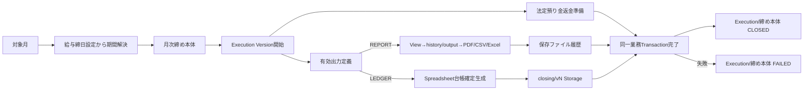

# 月次締め 画面から確定履歴・帳票までの処理フロー V1

## 1. 全体像

## 2. 画面

`MonthlyOperationPage.vue`は対象月と「概要」「帳票」タブを持つ。

- 未締め：`締め処理`
- 締め済み、または過去の完了Versionを持つ失敗状態：`再締め`
- 処理中：操作無効
- 帳票タブ：請求書・注文書を除く月次定義を表示

## 3. API

| method | path | 用途 |
|---|---|---|
| GET | `/api/operation/monthly/summary?targetMonth=...` | 月次概算と締め状態 |
| POST | `/api/operation/monthly/close` | 初回締め |
| POST | `/api/operation/monthly/reclose` | 再締め、Version+1 |
| GET | `/api/operation/monthly/report-files` | 指定Version・帳票コードの保存ファイル |

## 4. 締め期間

`MonthlyClosingPeriodService`は会社の給与締日設定を参照する。

- 月末：対象月1日～月末
- 日付指定：前月締日の翌日～対象月締日

解決した開始日・終了日・Ruleは`monthly_closings`へSnapshot保存し、再締め時には現在の設定から再解決する。

## 5. 実行開始とVersion

`MonthlyClosingCommandService`は対象月の締め本体を作成/取得し、次Versionを既存実行履歴と完了Versionの最大値+1で決定する。

`MonthlyClosingExecutionStateService.startNew`は別Transactionで次を保存する。

- 締め本体を`PROCESSING`
- `monthly_closing_execution`を`PROCESSING`
- 有効出力定義ごとの`monthly_closing_item`を`WAITING`
- 認証ユーザーを`executed_by`

## 6. 業務確定Transaction

`MonthlyClosingWorkflowService`は1 Transactionで次を実行する。

1. `LegalDepositRefundService`が対象期間の法定預り金返金を準備する。
2. `MonthlyClosingJobService`が出力定義を順番に実行する。
3. REPORTは`MonthlyClosingJobExecutor`からBatch帳票を実行する。
4. LEDGERは`SpreadsheetLedgerGenerationService.generateForClosing`を実行する。

途中失敗時は業務DB変更をrollbackし、外側でExecutionと締め本体を`FAILED`に更新する。

## 7. 帳票の確定経路

REPORT Jobには`targetMonth`、締め開始/終了日、Version、初回/再締め区分を渡す。帳票固有のStored ProcedureがViewの値をhistory/outputへ確定し、Exporterがファイルを生成する。

生成ファイルは`monthly_closing_report_files`へ記録する。画面の印刷ボタンはBatchを再実行せず、この保存ファイルをPDF ViewerまたはDownloadへ渡す。

## 8. 台帳の確定経路

LEDGER定義の`output_code`を`bookCode`として台帳生成基盤を呼ぶ。選択型台帳は対象月の全従業員等を個別生成し、Storageの`closing/v{version}`へ保存する。

## 9. 完了・失敗

成功時は出力項目、Executionを完了し、締め本体を`CLOSED`、Version、日時、実行者で更新する。失敗時は未完了項目、Execution、締め本体を`FAILED`とし、最大4,000文字のエラーを保存する。
