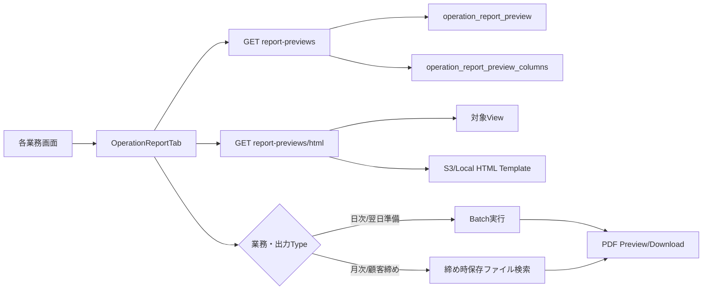

# 帳票Preview共通基盤 画面から出力までの処理フロー V1

## 1. 全体像

## 2. 画面側の処理

`OperationReportTab.vue`は次の値を親画面から受け取る。

| prop | 用途 |
|---|---|
| `operationType` | `PREPARATION`、`DAILY`、`MONTHLY`、`BOOK`の定義絞込み |
| `targetDate` | 日次・翌日準備のPreview/Batch対象日 |
| `targetMonth` | 月次・顧客締めのPreview/保存済み帳票検索月 |
| `closingVersion` | 自社月次締めの確定Version |
| `allowMixedClosingVersions` | 顧客ごとにVersionが異なる顧客締め帳票の取得許可 |
| `allowedReportCodes` | 親画面で表示を許可する帳票コード |
| `excludedReportCodes` | 親画面で除外する帳票コード |

帳票カードを選択するとHTML Previewダイアログを開く。HTML取得対象は`NONE`と`EXCEL_BOOK`以外であり、PDF/CSV/Excelについても本出力前の簡易データ確認としてHTMLを表示する。

## 3. 定義取得API

| method | path | 処理 |
|---|---|---|
| GET | `/api/operation/report-previews?operationType=...` | 有効な帳票定義と列定義を表示順で返す |
| GET | `/api/operation/report-previews/html` | 対象ViewとHTML Templateを使ってPreview HTMLを返す |

主要クラスは次のとおり。

| クラス | 役割 |
|---|---|
| `OperationReportPreviewController` | 定義一覧とHTML Preview API |
| `OperationReportPreviewService` | Preview定義・列・帳票名の組立て |
| `OperationReportPreviewHtmlService` | 行取得、列決定、Template読込、HTML描画 |
| `OperationReportPreviewRowReaderService` | tenant・対象日/月でViewを安全に検索 |
| `ReportHtmlTemplateLoader` | S3/LocalからHTML Templateを取得 |
| `ReportHtmlTemplateRenderer` | ThymeleafでHTMLを描画 |

## 4. HTML Previewのデータ経路

1. `reportCode`と`operationType`から有効な定義を検索する。
2. 定義の`table_name`を対象View/表として読む。
3. 常に`tenant_id`を条件に含める。
4. `MONTHLY`は`target_month`、`DAILY`は既定で`payment_date`、その他は`target_date`を検索する。設定された`filter_column_name`があれば優先する。
5. 列定義があればその列・表示名・順番を使う。なければ先頭行から技術列を除いて推測する。
6. 専用HTML Templateを読み、Thymeleafで描画する。HTML系出力では専用Templateが必須となる。

`table_name`、`filter_column_name`、`order_by`は文字列設定だが、許可文字の検証後にSQLへ組み込まれる。値はNamed Parameterで渡される。

## 5. 本出力の分岐

| 条件 | 出力処理 |
|---|---|
| `HTML_PREVIEW` | 画面確認のみ。本出力ボタンなし |
| `HTML_PRINT` | Preview iframeへブラウザの`print()`を実行。履歴保存なし |
| 日次/翌日準備の`PDF` | `jobCode`でBatch実行し、生成PDFを共通PDF Viewerで表示して印刷 |
| 日次/翌日準備の`CSV/EXCEL/CUSTOM` | Batch実行結果をDownload |
| 月次/顧客締めの`PDF/CSV/EXCEL` | Batchを再実行せず、締め時の`monthly_closing_report_files`を取得 |

月次保存ファイルは`GET /api/operation/monthly/report-files`で取得する。PDFはViewerへ渡し、複数顧客分がある場合はファイル選択ダイアログを表示する。

月次系画面では次の文言で両者を区別する。

- 帳票選択時：最新データの簡易Preview
- PDF/CSV/Excel操作時：締め時点の確定版を印刷・出力
- 顧客締めのファイル選択時：顧客ごとの最新確定版

## 6. 確定データとの関係

- HTML Preview：対象Viewの現在値を表示する。
- 日次本出力：ボタン押下時点でBatchを実行する。
- 月次・顧客締め本出力：締め処理時に生成・保存したファイルを表示する。

したがって、締め後に日報等を修正した場合、HTML Previewと保存済みPDFの内容が異なることがある。再締めを行うとVersionが増え、新しい確定ファイルが保存される。

## 7. tenant境界

Preview行検索はTenant Contextの値を必須とする。現行環境の正式なtenant IDである`default`は通常どおり使用できる。一方、Contextが未設定・空のrequestを`default`へ暗黙変換せずエラーにする。
